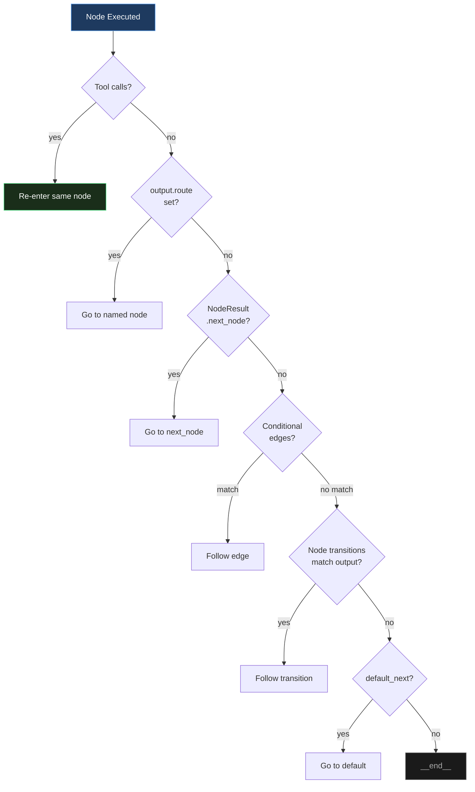

# Edges & Transitions

Edges define how the graph flows from one node to another. The engine resolves transitions dynamically at runtime using a 7-step priority system.

## Edge Dataclass

```python
from promptise.engine import Edge

Edge(
    from_node="plan",       # Source node name
    to_node="act",          # Target node name
    condition=my_fn,        # Optional: (NodeResult) -> bool
    label="ready",          # Optional: label for visualization
    priority=0,             # Optional: higher = checked first
)
```

## Edge Helpers

All helpers return `self` for chaining: `graph.always("a", "b").always("b", "c")`.

### always — Unconditional

```python
graph.always("plan", "execute")   # plan always goes to execute
```

### when — Conditional

```python
graph.when("review", "fix",
    condition=lambda result: result.output.get("quality", 0) < 3,
    label="low_quality",
)
```

### on_tool_call / on_no_tool_call — Tool-based routing

```python
graph.on_tool_call("agent", "agent")       # Loop back when tools called
graph.on_no_tool_call("agent", "__end__")   # End when no tools (final answer)
```

### on_output — Output key matching

```python
graph.on_output("review", "publish", key="approved", value=True)
graph.on_output("review", "revise", key="approved", value=False)
```

### on_error — Error routing

```python
graph.on_error("risky_step", "fallback")   # Route to fallback if node errors
```

### on_confidence — Confidence threshold

```python
graph.on_confidence("analyze", "conclude", min_confidence=0.7)
# Routes to "conclude" when output["confidence"] >= 0.7
```

### on_guard_fail — Guard failure routing

```python
graph.on_guard_fail("validate", "revise")
# Routes to "revise" when any guard fails
```

### sequential — Chain multiple nodes

```python
graph.sequential("step1", "step2", "step3", "step4")
# Creates: step1 → step2 → step3 → step4 (always edges)
```

### loop_until — Conditional loop with exit

```python
graph.loop_until("refine", "deliver",
    condition=lambda result: result.output.get("quality", 0) >= 4,
    max_iterations=5,
)
# Loops "refine" until quality >= 4, then exits to "deliver"
# Exit edge gets priority=10, loop edge gets priority=0
```

### Low-level add_edge

```python
graph.add_edge("a", "b", condition=my_fn, label="custom", priority=10)
```

!!! note "Performance"
    The engine maintains a precomputed adjacency index for **O(1) edge lookup** per transition (instead of scanning all edges). The index is rebuilt lazily when edges are added or removed.

## Transition Resolution

When a node finishes, the engine resolves the next node in this order:



1. **Tool loop** — If tools were called, re-enter the same node so the LLM sees tool results
2. **LLM routing** — If output contains `route`, `_next`, `next_step`, or `goto` naming a valid node
3. **NodeResult.next_node** — If the node explicitly set the next node in its execute() method
4. **Graph edges** — Conditional edges checked in priority order (highest first)
5. **Node transitions** — Output keys matched against the node's `transitions` dict
6. **default_next** — Fallback node from the node's configuration
7. **__end__** — Graph terminates

## Edge Priority

When multiple conditional edges exist from the same node, they are checked in **priority order** (highest first). Use this to ensure exit conditions are checked before loop conditions:

```python
# Exit condition checked first (priority 10)
graph.when("refine", "deliver",
    condition=lambda r: r.output.get("done"),
    label="done", priority=10)

# Loop condition checked second (priority 0)
graph.always("refine", "refine")  # default priority=0
```

## Dynamic LLM Routing

The LLM can choose the next node by including a routing field in its output:

```python
# The LLM outputs: {"route": "search", "reason": "Need more data"}
# → Engine goes to "search" node

# Supported field names: route, _next, next_step, goto
```

For this to work, the target node must exist in the graph (or be `__end__`). The engine injects available routes into the prompt when the node has transitions configured.

## Runtime Graph Mutation

The LLM can modify the graph during execution via structured output:

| Action | Output Fields | Description |
|--------|--------------|-------------|
| `add_node` | `_graph_action: "add_node"`, `_node_config: {...}` | Add a new node to the live graph |
| `skip_to` | `_graph_action: "skip_to"`, `_target: "node_name"` | Jump directly to another node |
| `add_edge` | `_graph_action: "add_edge"`, `_from: "a"`, `_to: "b"` | Add a new edge between existing nodes |
| `retry_with` | `_graph_action: "retry_with"`, `_context_update: {...}` | Update context and retry current node |

Mutations are applied to a per-invocation copy of the graph — the original is never modified. The engine caps mutations at `max_mutations_per_run` (default: 10).
