# Engine Internals

How the Reasoning Engine works under the hood — execution flow, transition resolution, autonomous path building, caching, flag processing, and the complete data flow from `build_agent()` to tool response.

## The Big Picture

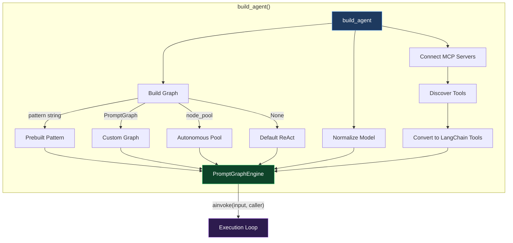

## Execution Loop — What Happens on Every `ainvoke()`

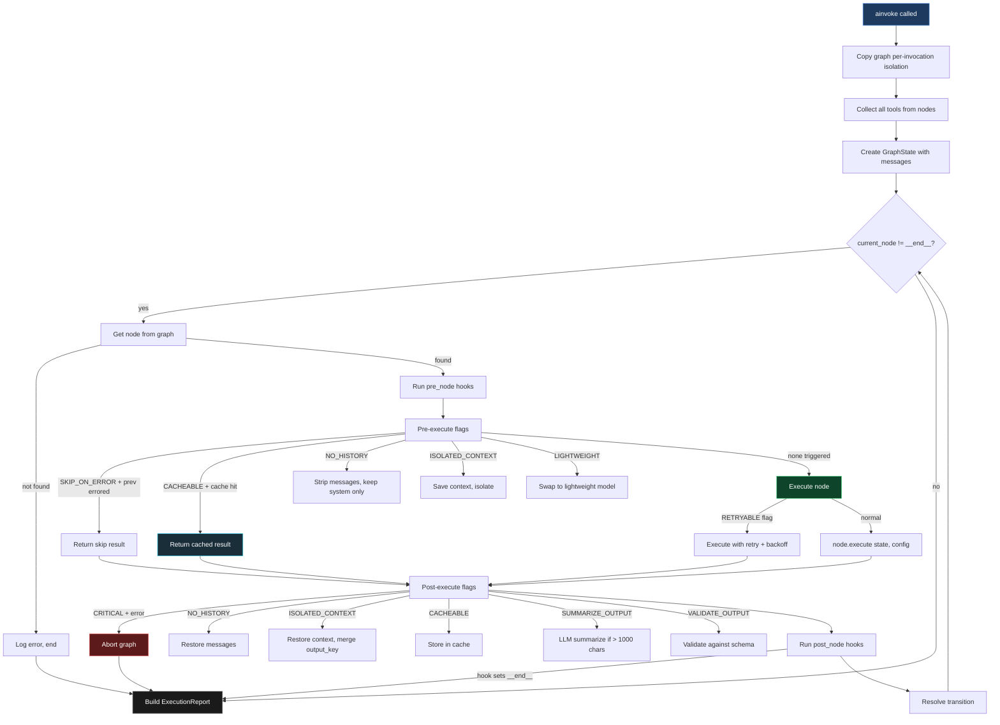

## Transition Resolution — How the Engine Picks the Next Node

After every node executes, the engine decides where to go next. This is the 7-step priority chain:

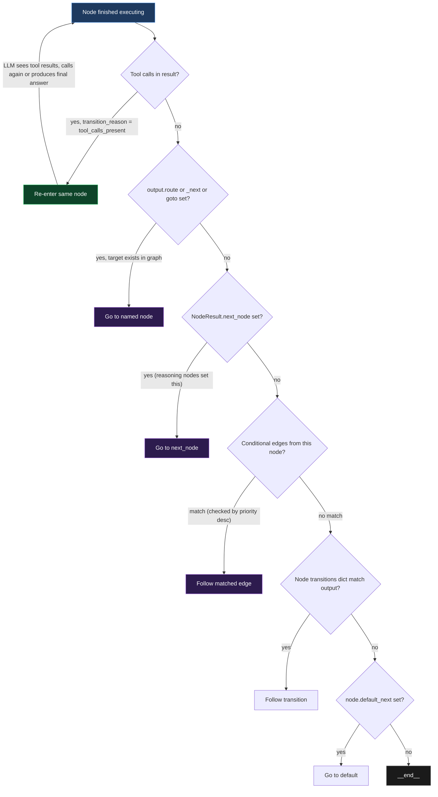

**Key insight:** Tool-calling nodes re-enter themselves automatically. The LLM calls tools → engine adds ToolMessages to conversation → re-enters the node → LLM sees results → calls more tools or produces final answer. This loop continues until the LLM stops calling tools.

## Autonomous Mode — How the AI Builds Its Own Path

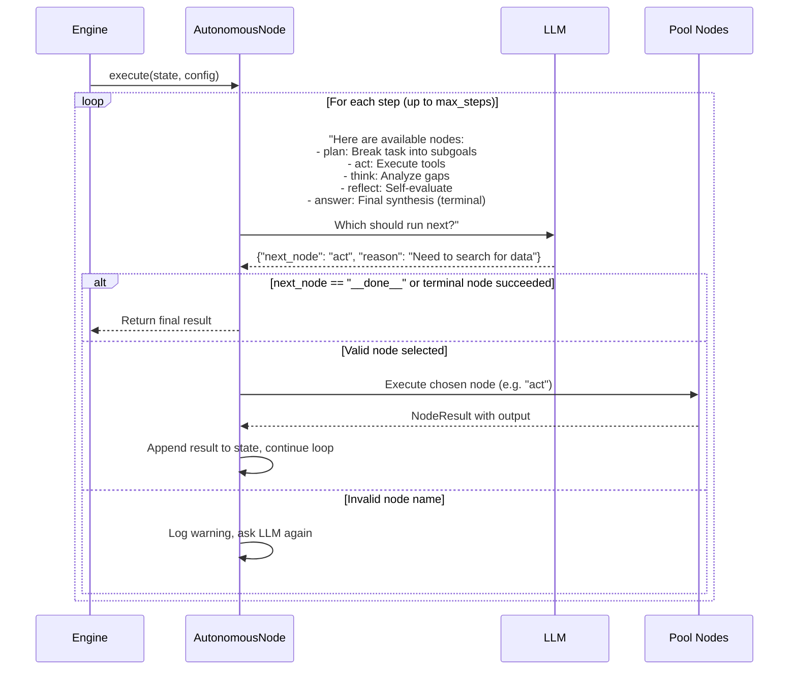

In autonomous mode, the `AutonomousNode` wraps the pool and orchestrates:

1. Builds a routing prompt listing all available nodes with descriptions
2. Asks the LLM which node to run next
3. Extracts JSON from the response (balanced brace parser for nested objects)
4. Executes the chosen node
5. Records result in state
6. Loops back to step 2 until the LLM chooses `__done__` or a terminal node succeeds

The developer controls the pool composition — what nodes are available. The LLM controls the path — which nodes to use and in what order.

## PromptNode Execution — The 9-Step Pipeline

Every PromptNode runs this pipeline internally:

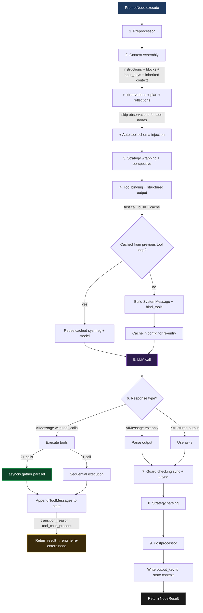

## Caching Strategy — What Gets Cached and When

```mermaid
graph LR
    subgraph "First execution (cold)"
        A1[Build system prompt] --> A2[Resolve tools]
        A2 --> A3[bind_tools on model]
        A3 --> A4[Create SystemMessage]
        A4 --> A5[Build tool_map dict]
        A5 --> A6["Cache all in config[_node_cache_{name}]"]
    end

    subgraph "Tool loop re-entry (hot)"
        B1["Read from config cache"] --> B2[Reuse SystemMessage]
        B2 --> B3[Reuse bound model]
        B3 --> B4[Reuse tool_map]
        B4 --> B5[Skip: prompt assembly, tool resolution, bind_tools]
    end

    A6 -.-> B1

    style A6 fill:#22d3ee,stroke:#0891b2,color:#000
    style B1 fill:#22d3ee,stroke:#0891b2,color:#000
```

**What's cached per node:**

| Item | Cache key | Rebuilt when? |
|------|-----------|---------------|
| SystemMessage (assembled prompt) | `config[_node_cache_{name}].sys_msg` | Never during same invocation |
| Bound model (with tools) | `config[_node_cache_{name}].model` | Never during same invocation |
| Active tools list | `config[_node_cache_{name}].tools` | Never during same invocation |
| Tool name→instance map | `config[_tool_map_{name}]` | Never during same invocation |
| Edge adjacency index | `graph._edge_index` | On edge add/remove (lazy dirty flag) |
| Node result (CACHEABLE flag) | `state.context._node_cache[hash]` | When input_keys change |

## Flag Processing Order

Flags are processed in two phases around node execution:

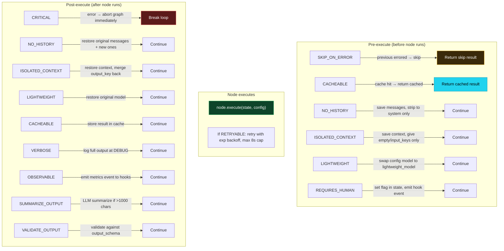

## Data Flow Between Nodes

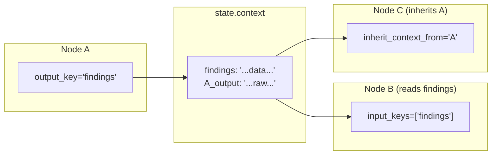

Three ways nodes pass data:

| Method | How it works | Use when |
|--------|-------------|----------|
| `output_key` → `input_keys` | Node A writes to `state.context[output_key]`. Node B reads from `state.context[input_keys[i]]`. | Structured data with named fields |
| `inherit_context_from` | Node B gets `state.context["{A_name}_output"]` auto-injected into its prompt. | One node directly continues another's work |
| `state.context` direct | Node's execute() reads/writes `state.context` directly. | Custom state management in BaseNode subclasses |

## CallerContext → MCP Server Identity Flow

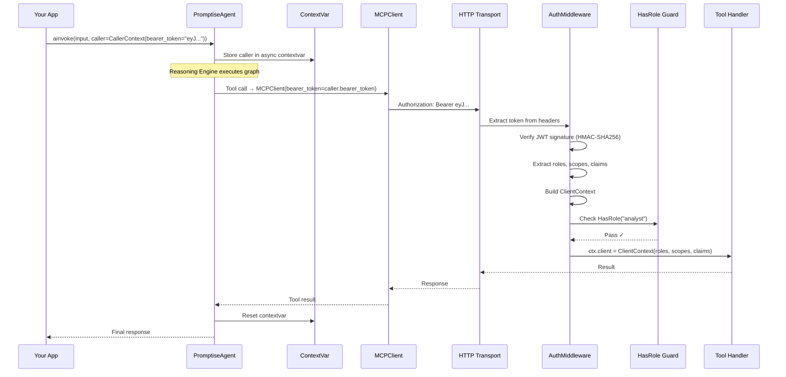

## Hook Execution Points

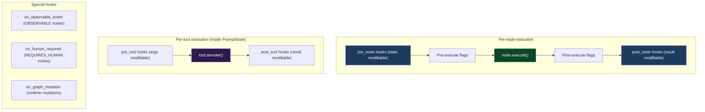

All hooks are wrapped in try/except — a failing hook never crashes the graph. Hooks run in registration order.

## Safety Mechanisms

```mermaid
graph TD
    subgraph "Iteration Guards"
        S1["max_iterations (default 50)"] --> |exceeded| S1R["Force graph end"]
        S2["max_node_iterations (default 25)"] --> |exceeded| S2R["_handle_stuck_node()"]
        S2R --> |"error transition exists"| S2A["Follow error edge"]
        S2R --> |"__error__ node exists"| S2B["Go to error handler"]
        S2R --> |"nothing"| S2C["Force __end__"]
    end

    subgraph "Budget & Health"
        S3["BudgetHook.max_tokens"] --> |exceeded| S3R["Set current_node = __end__"]
        S4["CycleDetectionHook"] --> |"pattern repeats N times"| S4R["Force __end__"]
        S5["TimingHook"] --> |"node exceeds budget"| S5R["Set error on result"]
    end

    subgraph "Error Recovery"
        S6["CRITICAL flag + error"] --> S6R["Abort immediately, report.error set"]
        S7["RETRYABLE flag + error"] --> S7R["Retry up to max_iterations times"]
        S7R --> |"backoff"| S7B["0.5s, 1s, 2s, 4s, 8s (capped)"]
        S8["SKIP_ON_ERROR"] --> S8R["Skip node, continue graph"]
    end

    subgraph "Graph Isolation"
        S9["graph.copy() per invocation"] --> S9R["Mutations don't affect original"]
        S10["config = dict(config)"] --> S10R["Concurrent calls don't interfere"]
        S11["max_mutations_per_run (default 10)"] --> S11R["Cap LLM graph modifications"]
    end

    style S6R fill:#5c1a1a,stroke:#f87171,color:#fff
    style S7B fill:#3a2a0a,stroke:#fbbf24,color:#fff
    style S9R fill:#0e4429,stroke:#4ade80,color:#fff
```

## Performance Architecture

```
Measurement: 5-node pipeline × 100 invocations

Per-node overhead:     0.009ms (9 microseconds)
Per-invocation:        0.04ms
PromptNode (mock LLM): 0.02ms

Where time goes:
├── Graph copy:           ~0.001ms (once per invocation)
├── Edge lookup:          ~0.0001ms (O(1) adjacency index)
├── Flag processing:      ~0.001ms (conditional checks)
├── Hook execution:       ~0.001ms (if hooks registered)
├── System prompt cache:  ~0.0001ms (dict lookup on re-entry)
├── Tool map cache:       ~0.0001ms (dict lookup)
└── LLM call:             99.99% of wall clock time
```

The engine is not the bottleneck. The LLM provider is.
