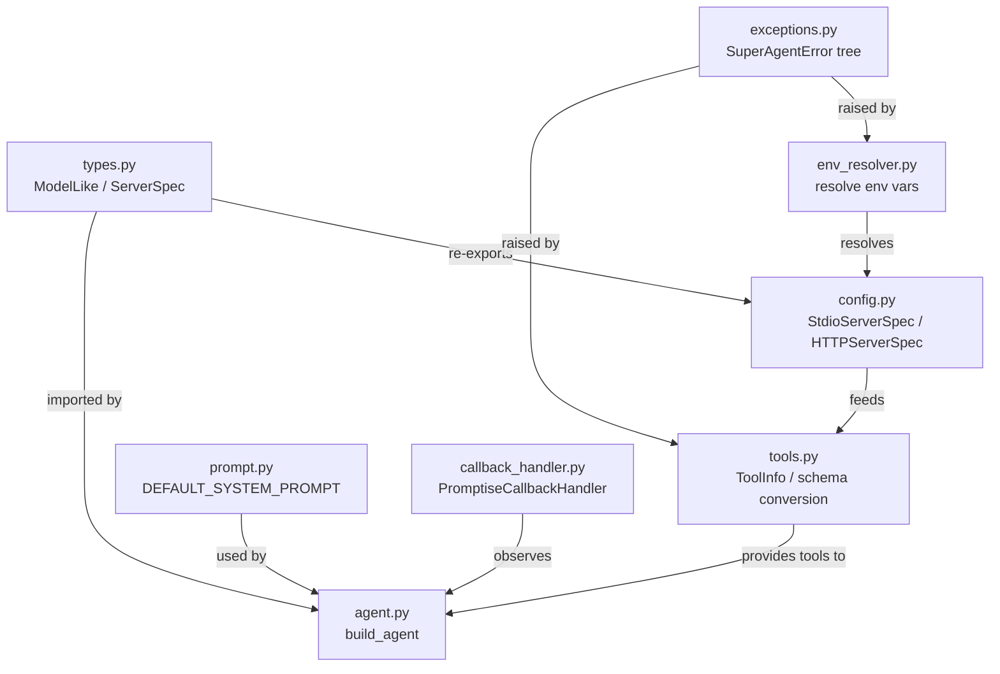

# Agent

The Agent is the foundation of Promptise Foundry. `build_agent()` returns a production-ready agent with opt-in capabilities — memory, guardrails, semantic cache, reasoning patterns, approval workflows, streaming, and more. Every feature is one parameter away.

## Quick example

```python
import asyncio
from promptise import build_agent, StdioServerSpec

async def main():
    agent = await build_agent(
        model="openai:gpt-5-mini",
        servers={
            "math": StdioServerSpec(
                command="python",
                args=["-m", "my_math_server"],
            ),
        },
    )
    result = await agent.ainvoke(
        {"messages": [{"role": "user", "content": "What is 42 * 17?"}]}
    )
    print(result["messages"][-1].content)

asyncio.run(main())
```

## Capability Map

Every capability is a single parameter on `build_agent()`. Start with just `model` + `servers`, then add capabilities as needed.

```
build_agent()
│
├─ Core (always active)
│   model ─────────────── LLM provider ("openai:gpt-5-mini", "anthropic:claude-sonnet-4.5", etc.)
│   servers ───────────── MCP tool servers (StdioServerSpec, HttpServerSpec)
│   instructions ──────── System prompt
│
├─ Reasoning ──────────── What pattern does the agent use to think?
│   agent_pattern ─────── "react", "peoatr", "research", "autonomous", "deliberate", "debate", or PromptGraph
│   node_pool ─────────── List of reasoning nodes for autonomous mode
│
├─ Memory & State ─────── What does the agent remember?
│   memory ────────────── InMemoryProvider, ChromaProvider, Mem0Provider
│   conversation_store ── SQLiteConversationStore, PostgresConversationStore, RedisConversationStore
│   cache ─────────────── SemanticCache (in-memory or Redis)
│
├─ Security & Safety ──── What guardrails protect the agent?
│   guardrails ────────── PromptiseSecurityScanner (injection, PII, credentials, toxicity)
│   approval ──────────── ApprovalConfig (human-in-the-loop for tool calls)
│   sandbox ───────────── SandboxConfig (Docker isolation for code execution)
│
├─ Performance ────────── How fast and cost-effective?
│   tool_optimization ─── NONE, MINIMAL, STANDARD, SEMANTIC (40-70% fewer tokens)
│   fallback_models ───── List of fallback models if primary fails
│   adaptive ──────────── AdaptiveConfig (learn from past interactions)
│
├─ Execution ──────────── How does the agent run?
│   streaming ─────────── Built-in (astream_with_tools)
│   events ────────────── EventConfig (webhooks, notifications)
│   observability ─────── ObservabilityConfig (4 levels, 8 transporters)
│
└─ Identity ───────────── Who is calling?
    caller ────────────── CallerContext (user_id, roles, scopes, bearer_token)
```

## Which Feature Do I Need?

| I want to... | Use this |
|---|---|
| Connect to MCP tool servers | `servers=` with `StdioServerSpec` or `HttpServerSpec` |
| Change how the agent reasons | `agent_pattern=` — see [Reasoning Patterns](agents/reasoning-patterns.md) |
| Give the agent memory across sessions | `memory=` — see [Memory](memory.md) |
| Persist conversations | `conversation_store=` — see [Conversations](conversations.md) |
| Block prompt injection / PII leaks | `guardrails=` — see [Guardrails](guardrails.md) |
| Require human approval for actions | `approval=` — see [Approval](approval.md) |
| Run untrusted code safely | `sandbox=` — see [Sandbox](sandbox.md) |
| Reduce token costs | `tool_optimization=` — see [Tool Optimization](tool-optimization.md) |
| Cache similar queries | `cache=` — see [Semantic Cache](cache.md) |
| Handle LLM provider outages | `fallback_models=` — see [Model Fallback](fallback.md) |
| Stream responses in real-time | `agent.astream_with_tools()` — see [Streaming](streaming.md) |
| Track token usage and latency | `observability=` — see [Observability](observability.md) |
| Multi-user access control | `caller=` — see [CallerContext in Building Agents](agents/building-agents.md) |

## How Core Modules Relate



## Module Reference

| Module | Purpose | Key Exports |
|--------|---------|-------------|
| [Config & Server Specs](config.md) | Define how to connect to MCP servers (stdio or HTTP) | `StdioServerSpec`, `HTTPServerSpec`, `servers_to_mcp_config` |
| [Types & ModelLike](types.md) | Central type aliases used across the framework | `ModelLike`, `ServerSpec`, `CrossAgent` |
| [Environment Resolver](env-resolver.md) | Resolve `${VAR}` placeholders in configuration | `resolve_env_var`, `resolve_env_in_dict` |
| [Exceptions](exceptions.md) | Custom error hierarchy for configuration and runtime errors | `SuperAgentError`, `SuperAgentValidationError` |
| [Default System Prompt](default-prompt.md) | The default instructions given to every agent | `DEFAULT_SYSTEM_PROMPT` |
| [Callback Handler](callback-handler.md) | Bridge LangChain events into the observability pipeline | `PromptiseCallbackHandler` |
| [Tools & Schema Helpers](tools.md) | Convert MCP tool schemas to LangChain tools | `ToolInfo`, `MCPClientError` |

## What's Next

- [Building Agents](agents/building-agents.md) — complete `build_agent()` reference with all parameters
- [Reasoning Patterns](agents/reasoning-patterns.md) — 7 built-in patterns + custom graphs
- [Reasoning Graph Engine](engine.md) — nodes, edges, flags, hooks, and the execution engine
