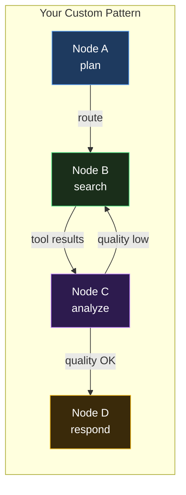
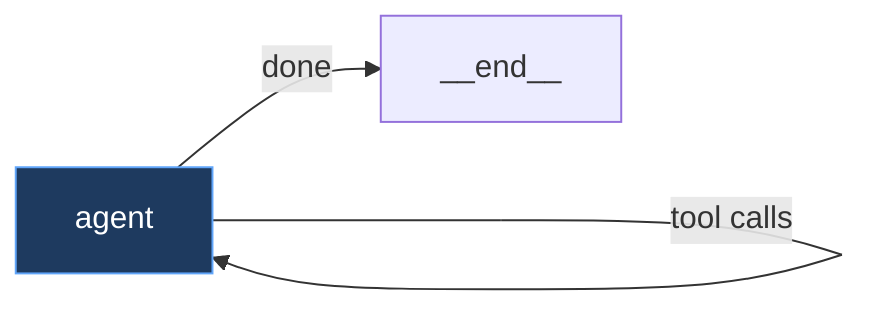
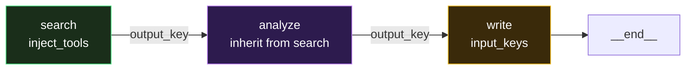
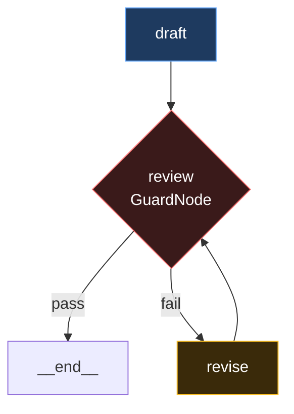
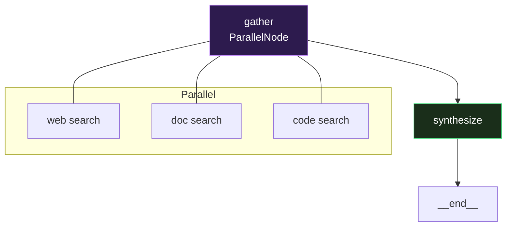
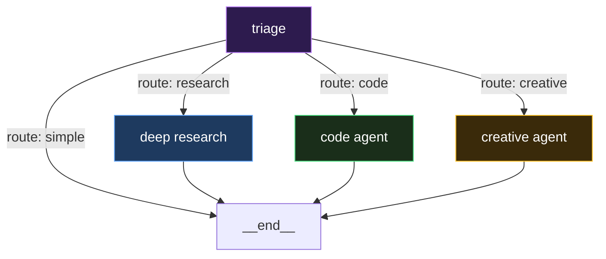

# Building Custom Agentic Reasoning Patterns

This guide shows how to build your own agent reasoning strategies using the Reasoning Graph — from simple tool-calling agents to sophisticated multi-stage reasoning systems.

## Concepts

A **reasoning pattern** is a graph of nodes. Each node is a complete processing unit. The engine traverses the graph, executing nodes and following edges. The LLM decides the path at runtime.



Each node controls:

- **What the LLM sees** — blocks, strategy, perspective, context layers
- **What the LLM can do** — tools, tool_choice, inject_tools
- **What the LLM must produce** — output_schema, guards
- **How data flows** — input_keys, output_key, inherit_context_from
- **Pre/post processing** — preprocessor, postprocessor
- **Where to go next** — transitions, default_next, LLM-routed

## Example 1: Simple Tool Agent



The simplest pattern — one node with tools:

```python
from promptise.engine import PromptGraph, PromptNode

graph = PromptGraph("simple-agent")
graph.add_node(PromptNode(
    "agent",
    instructions="You are a helpful assistant. Use tools to answer questions.",
    tools=my_tools,
    default_next="agent",  # Loop back after tool calls
))
graph.set_entry("agent")
```

The engine handles everything: LLM calls, tool execution, re-entry, termination.

## Example 2: Research Pipeline



Three stages with data flow between nodes:

```python
graph = PromptGraph("researcher")

# Stage 1: Search (has tools)
graph.add_node(PromptNode(
    "search",
    instructions="Search for information about the topic.",
    tools=search_tools,
    output_key="search_results",      # Write results to state
    include_observations=True,
    default_next="analyze",
))

# Stage 2: Analyze (reads search results, no tools)
graph.add_node(PromptNode(
    "analyze",
    instructions="Analyze the search results. Identify key findings.",
    inherit_context_from="search",    # Read search output
    tools=None,
    output_key="analysis",
    default_next="write",
))

# Stage 3: Write (reads analysis, produces final answer)
graph.add_node(PromptNode(
    "write",
    instructions="Write a comprehensive answer based on the analysis.",
    input_keys=["analysis", "search_results"],
    strategy=chain_of_thought,
    tools=None,
    default_next="__end__",
))

graph.set_entry("search")
```

## Example 3: Quality-Controlled Output



Add a guard node for quality control with retry:

```python
from promptise.engine import PromptNode, GuardNode, PromptGraph

graph = PromptGraph("quality-agent")

graph.add_node(PromptNode(
    "draft",
    instructions="Write a technical blog post about the topic.",
    tools=research_tools,
    output_key="draft",
    default_next="review",
))

graph.add_node(GuardNode(
    "review",
    guards=[
        LengthGuard(min=500, max=3000),
        ContentFilterGuard(required=["conclusion", "introduction"]),
    ],
    on_pass="__end__",
    on_fail="revise",
))

graph.add_node(PromptNode(
    "revise",
    instructions="The draft failed quality review. Revise it.",
    inherit_context_from="draft",
    input_keys=["review_feedback"],
    output_key="draft",
    default_next="review",
    max_iterations=3,
))

graph.set_entry("draft")
```

## Example 4: Parallel Research



Search multiple sources simultaneously:

```python
from promptise.engine import PromptNode, ParallelNode, PromptGraph

graph = PromptGraph("parallel-research")

graph.add_node(ParallelNode(
    "gather",
    nodes=[
        PromptNode("web", tools=[web_search], instructions="Search the web."),
        PromptNode("docs", tools=[doc_search], instructions="Search documentation."),
        PromptNode("code", tools=[code_search], instructions="Search codebases."),
    ],
    default_next="synthesize",
))

graph.add_node(PromptNode(
    "synthesize",
    instructions="Combine findings from all three sources.",
    include_observations=True,
    strategy=chain_of_thought + self_critique,
    default_next="__end__",
))

graph.set_entry("gather")
```

## Example 5: Dynamic LLM Routing



The LLM decides where to go at each step:

```python
graph = PromptGraph("dynamic-agent")

graph.add_node(PromptNode(
    "triage",
    instructions=(
        "Analyze the user's request. Decide the approach.\n"
        "Set 'route' to one of: simple_answer, research, code_task, creative"
    ),
    tools=None,
    transitions={
        "simple_answer": "__end__",
        "research": "deep_research",
        "code_task": "code_agent",
        "creative": "creative_agent",
    },
))

graph.add_node(PromptNode("deep_research", tools=search_tools, default_next="__end__"))
graph.add_node(PromptNode("code_agent", tools=code_tools, default_next="__end__"))
graph.add_node(PromptNode("creative_agent", strategy=creative, default_next="__end__"))

graph.set_entry("triage")
```

## Example 6: Custom Preprocessing

Transform data before the LLM sees it:

```python
async def load_customer_data(state, config):
    """Preprocessor: load customer data into context."""
    customer_id = state.context.get("customer_id")
    if customer_id:
        data = await crm.get_customer(customer_id)
        state.context["customer_name"] = data.name
        state.context["customer_tier"] = data.tier
        state.context["customer_history"] = data.recent_tickets[:5]

async def format_ticket(output, state, config):
    """Postprocessor: format the output as a support ticket."""
    return {
        "ticket_id": generate_id(),
        "customer": state.context.get("customer_name"),
        "resolution": output,
        "created_at": datetime.now().isoformat(),
    }

graph.add_node(PromptNode(
    "support",
    instructions="Resolve the customer's issue.",
    tools=support_tools,
    preprocessor=load_customer_data,
    postprocessor=format_ticket,
    output_key="ticket",
    default_next="__end__",
))
```

## Example 7: Custom Node Type

Build a completely custom node:

```python
from promptise.engine import BaseNode, GraphState, NodeResult

class APICallNode(BaseNode):
    """A node that calls an external API and processes the response."""

    def __init__(self, name, *, endpoint, headers=None, **kwargs):
        super().__init__(name, **kwargs)
        self.endpoint = endpoint
        self.headers = headers or {}

    async def execute(self, state, config):
        import httpx

        params = {k: state.context[k] for k in state.context if not k.startswith("_")}

        async with httpx.AsyncClient() as client:
            resp = await client.get(self.endpoint, params=params, headers=self.headers)
            data = resp.json()

        state.context[f"{self.name}_result"] = data
        state.observations.append({"tool": self.name, "result": str(data)[:500], "success": True})

        return NodeResult(node_name=self.name, node_type="api_call", output=data)

# Use it in a graph
graph.add_node(APICallNode("weather", endpoint="https://api.weather.com/current"))
graph.add_node(PromptNode("respond", inherit_context_from="weather"))
graph.always("weather", "respond")
```

## Example 8: Using the Graph with build_agent

```python
from promptise import build_agent
from promptise.config import HTTPServerSpec
from promptise.engine import PromptGraph, PromptNode
from promptise.prompts.blocks import Identity, Rules

# Build your custom graph
graph = PromptGraph("my-agent")
graph.add_node(PromptNode(
    "main",
    blocks=[
        Identity("Senior data analyst"),
        Rules(["Always cite sources", "Include confidence levels"]),
    ],
    tools=None,  # Will be populated by build_agent from MCP servers
))
graph.set_entry("main")

# Pass it to build_agent — tools from MCP servers are auto-injected
agent = await build_agent(
    model="openai:gpt-5-mini",
    servers={"analytics": HTTPServerSpec(url="http://localhost:8000/mcp")},
    pattern=graph,
)

result = await agent.ainvoke({"messages": [{"role": "user", "content": "Analyze Q4 trends"}]})
```

## Debugging

### Graph Visualization

```python
print(graph.describe())
print(graph.to_mermaid())
```

### Execution Report

```python
result = await engine.ainvoke(input)
print(engine.last_report.summary())
```

### Step-by-Step Inspection

```python
# Check node history after execution
for nr in state.node_history:
    print(f"{nr.node_name}: {nr.duration_ms:.0f}ms, tokens={nr.total_tokens}, "
          f"tools={len(nr.tool_calls)}, next={nr.next_node}")
```

### Hooks for Debugging

```python
from promptise.engine import LoggingHook

engine = PromptGraphEngine(
    graph=graph,
    model=model,
    hooks=[LoggingHook()],  # Logs every node entry/exit
)
```

## Production Hardening

### Node Flags for Safety

Use [typed flags](../core/engine-flags.md) to make graphs production-safe:

```python
from promptise.engine import PromptNode, NodeFlag
from promptise.engine.reasoning_nodes import ThinkNode, SynthesizeNode

graph = PromptGraph("production-safe", nodes=[
    # Must succeed — abort graph on failure
    ThinkNode("plan", is_entry=True, flags={NodeFlag.CRITICAL}),

    # Retry flaky API calls with exponential backoff
    PromptNode("fetch_data", inject_tools=True,
               flags={NodeFlag.RETRYABLE, NodeFlag.OBSERVABLE}),

    # Skip enrichment if fetch failed — don't block the pipeline
    PromptNode("enrich", flags={NodeFlag.SKIP_ON_ERROR}),

    # Cache expensive analysis — same inputs return cached result
    PromptNode("analyze", flags={NodeFlag.CACHEABLE},
               input_keys=["data"], output_key="analysis"),

    # Final answer with cost-optimized model
    SynthesizeNode("answer", is_terminal=True,
                   model_override="openai:gpt-4o-mini"),
])
```

### Processors for Data Quality

```python
from promptise.engine.processors import (
    json_extractor, confidence_scorer, input_validator,
    chain_preprocessors, chain_postprocessors,
)

PromptNode("analyze",
    # Validate input before LLM call
    preprocessor=chain_preprocessors(
        input_validator(required_keys=["query", "data"]),
    ),
    # Parse and score output after LLM call
    postprocessor=chain_postprocessors(
        json_extractor(keys=["answer", "confidence", "sources"]),
        confidence_scorer(),
    ),
)
```

### Budget and Metrics Hooks

```python
from promptise.engine import PromptGraphEngine, MetricsHook, BudgetHook

metrics = MetricsHook()
engine = PromptGraphEngine(
    graph=graph,
    model=model,
    hooks=[
        metrics,
        BudgetHook(max_tokens=50000, max_cost_usd=0.50),
    ],
)

result = await engine.ainvoke(input)

# Inspect per-node performance
for node_name, stats in metrics.summary().items():
    print(f"{node_name}: {stats['calls']} calls, "
          f"{stats['total_tokens']} tokens, "
          f"{stats['total_duration_ms']:.0f}ms")
```

### Error Handling

```python
result = await agent.ainvoke({"messages": [...]})
report = agent._inner.last_report

# Check if a CRITICAL node caused early termination
if report and report.error:
    print(f"Graph aborted: {report.error}")

# Check individual node errors
for nr in report.nodes_visited if report else []:
    if hasattr(nr, 'error') and nr.error:
        print(f"Node {nr.node_name} failed: {nr.error}")
```

## Best Practices

1. **Start simple** — Use `PromptGraph.react()` first. Add complexity only when needed.
2. **One responsibility per node** — Each node should do ONE thing well.
3. **Use output_key/input_keys** — Explicit data flow is easier to debug than implicit state.
4. **Set max_iterations** — Every node that can loop should have a limit.
5. **Add guards** — Validate output at key checkpoints, not just at the end.
6. **Use flags for safety** — `CRITICAL` for must-succeed nodes, `RETRYABLE` for flaky calls, `SKIP_ON_ERROR` for optional steps.
7. **Use hooks for cross-cutting concerns** — Logging, timing, metrics, budget enforcement.
8. **Test incrementally** — Test each node in isolation, then the graph.
9. **Use model_override for cost** — Cheap models for routing/classification, expensive for reasoning/synthesis.
10. **Cap everything** — Observations (capped at 50), reflections (capped at 5), node iterations, total iterations.
