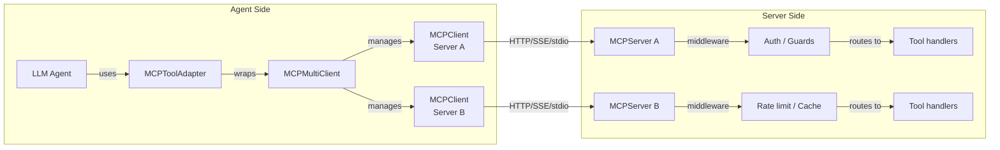

# MCP Overview

Build MCP servers that AI agents can connect to for tool access, and connect agents to existing servers with the client SDK. Promptise Foundry's MCP implementation is fully protocol-compliant and adds production features like authentication, middleware, guards, caching, rate limiting, and observability on top.

## Quick Example

**Server** -- expose tools that agents can call:

```python
from promptise.mcp.server import MCPServer

server = MCPServer(name="math-tools", version="1.0.0")

@server.tool()
async def add(a: int, b: int) -> int:
    """Add two numbers."""
    return a + b

server.run()
```

**Agent** -- connect and let the LLM decide which tools to call:

```python
import asyncio
from promptise import build_agent, HTTPServerSpec

async def main():
    agent = await build_agent(
        model="openai:gpt-5-mini",
        servers={
            "math": HTTPServerSpec(url="http://localhost:8080/mcp"),
        },
    )
    result = await agent.ainvoke(
        {"messages": [{"role": "user", "content": "What is 42 + 58?"}]}
    )
    print(result["messages"][-1].content)

asyncio.run(main())
```

That's it -- the agent discovers tools from the server automatically, no manual wiring needed.

## Developer Journey

Whether you're building a new tool server or connecting an agent to existing servers, here's the path from zero to production:

### Building Servers


| Step | Page | What you'll learn |
|------|------|-------------------|
| 1 | [Step-by-Step Guide](../guides/production-mcp-servers.md) | Build a complete server from scratch, adding one feature at a time |
| 2 | [Server Fundamentals](server/building-servers.md) | Deep reference for tools, resources, prompts, lifecycle hooks, config |
| 3 | [Routers & Middleware](server/routers-middleware.md) | Organize tools into modules, add logging/timeouts/custom middleware |
| 4 | [Auth & Security](server/auth-security.md) | JWT auth, API keys, asymmetric JWT, guards, dependency injection |
| 5 | [Production Features](server/production-features.md) | Hub page linking to deep-dive pages below |
| 5a | [Caching & Performance](server/caching-performance.md) | `@cached`, `InMemoryCache`, `RedisCache`, rate limiting, concurrency, timeouts |
| 5b | [Observability & Monitoring](server/observability.md) | Metrics, OTel, Prometheus, structured logging, audit trails, dashboard |
| 5c | [Resilience Patterns](server/resilience-patterns.md) | Circuit breaker, health checks, webhooks, background tasks, cancellation |
| 5d | [Advanced Patterns](server/advanced-patterns.md) | Versioning, transforms, composition, OpenAPI, batch, streaming, elicitation |
| 6 | [Deployment](server/deployment.md) | HTTP transport, CORS, reverse proxy, Docker, CLI serve, hot reload |
| 7 | [Testing](server/testing.md) | Test servers in-process with `TestClient` -- no transport needed |

!!! tip "Start with the Step-by-Step Guide"
    If you're new to building MCP servers, the [Step-by-Step Guide](../guides/production-mcp-servers.md) walks you through building a production server in 9 incremental steps. Each step adds one concept (validation, auth, routers, middleware, etc.) so you understand the full picture before diving into reference docs.

### Connecting Agents

| Step | Page | What you'll learn |
|------|------|-------------------|
| 1 | [Client Guide](client/index.md) | `MCPClient`, `MCPMultiClient`, auth, transports, multi-server aggregation |
| 2 | [Tool Adapter](client/tool-adapter.md) | Convert MCP tools to LangChain `BaseTool` for use with `build_agent()` |

Most developers don't need the client SDK directly -- `build_agent()` handles tool discovery and connection automatically. Use the client SDK when you need direct control over tool calls, multi-server routing, or custom callback hooks.

## Architecture



## What is MCP?

MCP (Model Context Protocol) defines a standard JSON-RPC interface for:

- **Tool discovery** -- servers expose a list of available tools with JSON Schema descriptions of their parameters.
- **Tool invocation** -- clients call tools by name with validated arguments and receive structured results.
- **Resource access** -- servers can expose read-only data resources.
- **Prompt templates** -- servers can expose reusable prompt templates.

The protocol supports three transport layers:

| Transport | Use case |
|-----------|----------|
| **Streamable HTTP** | Remote servers (default) |
| **SSE** (Server-Sent Events) | Streaming responses from remote servers |
| **stdio** | Local subprocess servers (Claude Desktop, Cursor, etc.) |

## Server SDK Features

Build production-ready MCP servers using the same patterns you know from web frameworks:

| Feature | Description |
|---------|-------------|
| **Decorator-based registration** | `@server.tool()`, `@server.resource()`, `@server.prompt()` |
| **Pydantic validation** | Automatic JSON Schema generation from type hints and Pydantic models |
| **Routers** | Group tools by domain with `MCPRouter`, apply shared auth/tags/guards |
| **Middleware chain** | Logging, timeouts, rate limiting, custom middleware in onion layers |
| **Authentication** | JWT (`JWTAuth`), API key (`APIKeyAuth`), custom providers |
| **Guards** | `RequireAuth`, `HasRole`, `HasAllRoles`, `RequireClientId`, custom guards |
| **Dependency injection** | `Depends()` for database connections, settings, cleanup |
| **Caching** | `@cached` decorator with `InMemoryCache` or custom backends |
| **Rate limiting** | `RateLimitMiddleware` with `TokenBucketLimiter`, per-tool granularity |
| **Health checks** | Liveness and readiness probes via `HealthCheck` |
| **Metrics** | `MetricsCollector` with per-tool call counts, error rates, latency |
| **Dashboard** | Live terminal UI with tool stats, agent activity, and logs |
| **Background tasks** | Fire-and-forget work via `BackgroundTasks` |
| **Exception handlers** | Map application exceptions to structured MCP error responses |
| **Structured outputs** | Return `ImageContent`, `EmbeddedResource`, or mixed content lists |
| **Tool annotations** | MCP spec hints: `read_only_hint`, `destructive_hint`, `idempotent_hint`, `open_world_hint` |
| **Per-tool concurrency** | `max_concurrent` per tool to protect downstream resources |
| **CORS** | `CORSConfig` for HTTP transport cross-origin support |
| **Progress tracking** | `ProgressReporter` for client progress notifications during long tools |
| **Server logging** | `ServerLogger` for server-to-client log messages |
| **Cancellation** | `CancellationToken` for interruptible long-running tools |
| **Session state** | `SessionState` for per-session key-value persistence |
| **OpenTelemetry** | `OTelMiddleware` for standardized tracing and metrics |
| **Prometheus** | `PrometheusMiddleware` for standard metrics export |
| **Structured logging** | `StructuredLoggingMiddleware` for JSON log output |
| **Redis cache** | `RedisCache` distributed cache backend for multi-instance deployments |
| **OpenAPI provider** | `OpenAPIProvider` auto-generates tools from OpenAPI/Swagger specs |
| **Server composition** | `mount()` composes child servers into a gateway with prefixed tools |
| **Hot reload** | `hot_reload()` watches files and restarts the server during development |
| **CLI serve** | `promptise serve module:server` runs servers from the command line |
| **Asymmetric JWT** | `AsymmetricJWTAuth` for RS256/ES256 JWT verification |
| **Tool versioning** | `VersionedToolRegistry` for multiple tool versions with pinned lookup |
| **Tool transforms** | `NamespaceTransform`, `VisibilityTransform`, `TagFilterTransform` modify tools at discovery |
| **Elicitation** | `Elicitor` requests structured user input mid-execution |
| **Sampling** | `Sampler` requests LLM completions from the client |
| **Circuit breaker** | `CircuitBreakerMiddleware` protects downstream services from cascading failures |
| **Audit logging** | `AuditMiddleware` with HMAC-chained tamper-evident audit trail |
| **Webhooks** | `WebhookMiddleware` fires HTTP webhooks on tool events |
| **Batch tool calls** | `register_batch_tool()` executes multiple tools in a single request |
| **Streaming results** | `StreamingResult` collects incremental results for streaming responses |
| **TestClient** | In-process testing through the full pipeline, no transport needed |
| **Lifecycle hooks** | `@server.on_startup` / `@server.on_shutdown` for resource management |

## Client SDK Features

Connect to one or many MCP servers with authentication and LangChain integration:

| Feature | Description |
|---------|-------------|
| **`MCPClient`** | Single-server client with bearer token, API key, or custom auth |
| **`MCPMultiClient`** | Multi-server aggregation with automatic tool routing |
| **`MCPToolAdapter`** | Convert MCP tools to LangChain `BaseTool` instances |
| **Three transports** | HTTP, SSE, and stdio |
| **Callback hooks** | `on_before`, `on_after`, `on_error` for tool call interception |

## Key Classes

| Class | Module | Purpose |
|-------|--------|---------|
| `MCPServer` | `promptise.mcp.server` | Build and run an MCP server |
| `MCPRouter` | `promptise.mcp.server` | Group tools/resources into modular routers |
| `TestClient` | `promptise.mcp.server.testing` | In-process testing without transport |
| `MCPClient` | `promptise.mcp.client` | Single-server client with token auth |
| `MCPMultiClient` | `promptise.mcp.client` | Multi-server aggregating client |
| `MCPToolAdapter` | `promptise.mcp.client` | MCP-to-LangChain tool converter |

## Common Patterns

### Choosing the Right Approach

| I want to... | Use |
|---|---|
| Build a tool server for agents | `MCPServer` + `@server.tool()` ([Step-by-Step Guide](../guides/production-mcp-servers.md)) |
| Add auth to my server | `JWTAuth` + `AuthMiddleware` + `auth=True` ([Auth & Security](server/auth-security.md)) |
| Organize tools by domain | `MCPRouter` with prefix and tags ([Routers & Middleware](server/routers-middleware.md)) |
| Cache tool results | `@cached` + `InMemoryCache` or `RedisCache` ([Caching & Performance](server/caching-performance.md)) |
| Rate limit agents | `RateLimitMiddleware` + `TokenBucketLimiter` ([Caching & Performance](server/caching-performance.md)) |
| Add metrics, tracing, audit logs | `MetricsMiddleware`, `OTelMiddleware`, `AuditMiddleware` ([Observability](server/observability.md)) |
| Protect against downstream failures | `CircuitBreakerMiddleware` + `HealthCheck` ([Resilience](server/resilience-patterns.md)) |
| Version tools or compose servers | `VersionedToolRegistry`, `mount()` ([Advanced Patterns](server/advanced-patterns.md)) |
| Wrap a REST API as MCP tools | `OpenAPIProvider` ([Advanced Patterns](server/advanced-patterns.md)) |
| Deploy with HTTP, CORS, Docker | Transport config + `CORSConfig` ([Deployment](server/deployment.md)) |
| Test my server without HTTP | `TestClient` ([Testing](server/testing.md)) |
| Connect an agent to servers | `build_agent()` with `HTTPServerSpec` (simplest) |
| Call MCP tools directly | `MCPClient` or `MCPMultiClient` ([Client Guide](client/index.md)) |
| Convert MCP tools to LangChain | `MCPToolAdapter` ([Tool Adapter](client/tool-adapter.md)) |

### Recommended Middleware Stack

For production servers, apply middleware in this order (outermost to innermost):

```python
from promptise.mcp.server import (
    MCPServer, AuthMiddleware, JWTAuth,
    LoggingMiddleware, TimeoutMiddleware, RateLimitMiddleware,
)

server = MCPServer(name="my-api", version="1.0.0")
jwt = JWTAuth(secret="your-secret-key-min-32-chars-long!!")

# 1. Logging (outermost -- sees everything)
server.add_middleware(LoggingMiddleware())
# 2. Auth (reject unauthenticated requests early)
server.add_middleware(AuthMiddleware(jwt))
# 3. Rate limiting (protect against abuse)
server.add_middleware(RateLimitMiddleware(rate_per_minute=100))
# 4. Timeouts (prevent runaway tool calls)
server.add_middleware(TimeoutMiddleware(default_timeout=30.0))
```

## Tips

!!! tip "Start with the Step-by-Step Guide"
    The [Step-by-Step Guide](../guides/production-mcp-servers.md) builds a complete production server in 9 incremental steps. Start there, then use the reference docs to go deeper.

!!! tip "Use `build_agent()` for the simplest agent connection"
    You don't need `MCPClient` or `MCPToolAdapter` directly. `build_agent()` handles tool discovery, schema conversion, and connection management automatically:

    ```python
    agent = await build_agent(
        model="openai:gpt-5-mini",
        servers={"math": HTTPServerSpec(url="http://localhost:8080/mcp")},
    )
    ```

!!! warning "Always use `async with` for clients"
    MCP clients use async context managers for proper session lifecycle. Always use `async with` to ensure connections are cleaned up.

!!! tip "Dev token endpoint for testing"
    Enable `server.enable_token_endpoint(...)` during development to issue test JWTs without an external identity provider. For production, use Auth0, Keycloak, or Okta.

## What's Next

- [Step-by-Step Guide](../guides/production-mcp-servers.md) -- build a production server in 9 steps
- [Server Fundamentals](server/building-servers.md) -- full reference for tools, resources, and server config
- [Client Guide](client/index.md) -- connect to MCP servers with authentication
- [API Reference: Server](../api/mcp-server.md) -- auto-generated API docs for every server class
- [API Reference: Client](../api/mcp-client.md) -- auto-generated API docs for every client class
