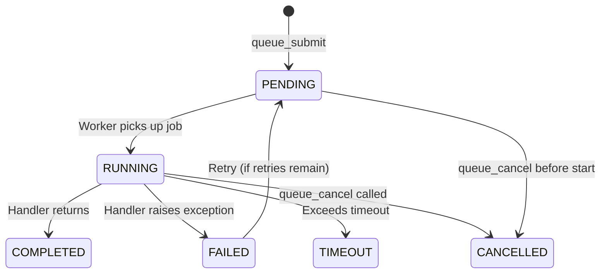

# Queue & Background Jobs

MCP tool calls are synchronous -- the agent sends a request and blocks until the response. This breaks down for long-running work like report generation, data pipelines, or model training. MCPQueue lets server authors define async job types that agents submit and poll for results, turning any long operation into a non-blocking workflow.

## Quick Start

```python
import asyncio

from promptise.mcp.server import MCPServer, MCPQueue

server = MCPServer(name="analytics")
queue = MCPQueue(server, max_workers=4)


@queue.job(name="generate_report", timeout=120)
async def generate_report(department: str) -> dict:
    """Generate a quarterly analytics report."""
    await asyncio.sleep(10)  # Simulate long-running work
    return {"department": department, "rows": 1250, "status": "ready"}


server.run(transport="http", port=8080)
```

MCPQueue auto-registers 5 MCP tools on the server. No extra wiring needed.

## How Agents Use It

Once your queue server is running, agents interact through 5 auto-registered tools:

| Tool | Purpose |
|------|---------|
| `queue_submit` | Submit a job -- returns a `job_id` immediately |
| `queue_status` | Check job status and progress |
| `queue_result` | Retrieve a completed job's return value |
| `queue_cancel` | Cancel a pending or running job |
| `queue_list` | List jobs (filterable by status) |

### Typical agent workflow

```
Agent: queue_submit(job_type="generate_report", args={"department": "Engineering"})
  -> {"job_id": "a1b2c3d4", "status": "pending", "job_type": "generate_report"}

Agent: queue_status(job_id="a1b2c3d4")
  -> {"status": "running", "progress": 0.3, "progress_message": "Processing Q3 data"}

Agent: queue_status(job_id="a1b2c3d4")
  -> {"status": "running", "progress": 0.7, "progress_message": "Generating charts"}

Agent: queue_result(job_id="a1b2c3d4")
  -> {"status": "completed", "result": {"department": "Engineering", "rows": 1250}}
```

## Defining Job Types

Use the `@queue.job()` decorator to register job types. Works like `@server.tool()` but for background work:

```python
@queue.job(
    name="train_model",       # Job type name (defaults to function name)
    timeout=600,              # Per-job timeout in seconds
    max_retries=2,            # Retry on failure
    backoff_base=2.0,         # Exponential backoff base (2s, 4s, 8s...)
)
async def train_model(dataset: str, epochs: int = 10) -> dict:
    """Train a machine learning model on the given dataset."""
    # Your long-running logic here
    return {"accuracy": 0.95, "model_id": "model-abc123"}
```

### Job arguments

Job handlers receive their arguments as keyword args, matching the `args` dict passed at submission time:

```python
# Agent submits:
queue_submit(job_type="train_model", args={"dataset": "sales-2024", "epochs": 20})

# Handler receives:
async def train_model(dataset: str, epochs: int = 10) -> dict:
    # dataset="sales-2024", epochs=20
    ...
```

## Progress Reporting

Jobs can report progress so agents can track long operations in real time. Annotate a parameter with `_JobProgressReporter`:

```python
from promptise.mcp.server import MCPQueue
from promptise.mcp.server._queue import _JobProgressReporter  # internal helper

queue = MCPQueue(server)


@queue.job(name="process_data", timeout=300)
async def process_data(
    file_path: str,
    progress: _JobProgressReporter,
) -> dict:
    """Process a large data file with progress tracking."""
    total_steps = 100
    for step in range(total_steps):
        await asyncio.sleep(0.1)  # Simulate work
        await progress.report(
            step + 1,
            total=total_steps,
            message=f"Processing chunk {step + 1}/{total_steps}",
        )
    return {"rows_processed": 10_000}
```

The progress reporter is injected automatically -- agents see real-time updates via `queue_status`:

```
Agent: queue_status(job_id="xyz")
  -> {"status": "running", "progress": 0.42, "progress_message": "Processing chunk 42/100"}
```

## Cancellation Support

Jobs can respond to cancellation requests. Annotate a parameter with `CancellationToken`:

```python
from promptise.mcp.server import CancellationToken

@queue.job(name="long_computation", timeout=600)
async def long_computation(
    iterations: int,
    progress: _JobProgressReporter,
    cancel: CancellationToken,
) -> dict:
    """A long computation that supports cancellation."""
    results = []
    for i in range(iterations):
        cancel.check()  # Raises CancelledError if cancelled
        await asyncio.sleep(0.5)
        results.append(i * i)
        await progress.report(i + 1, total=iterations)
    return {"results": results}
```

When an agent calls `queue_cancel(job_id="...")`, the cancellation token is signaled and the next `cancel.check()` raises `CancelledError`, cleanly stopping the job.

## Job Lifecycle



### Job states

| Status | Description |
|--------|-------------|
| `pending` | Queued, waiting for a worker |
| `running` | Currently being executed |
| `completed` | Finished successfully with a result |
| `failed` | Handler raised an exception (all retries exhausted) |
| `timeout` | Exceeded the configured timeout |
| `cancelled` | Cancelled by user via `queue_cancel` |

## Priority Scheduling

Jobs support 4 priority levels. Higher-priority jobs are dequeued first:

```
queue_submit(job_type="generate_report", args={...}, priority="critical")
```

| Priority | Description |
|----------|-------------|
| `critical` | Dequeued first. Emergency or time-sensitive work. |
| `high` | Before normal jobs. Important but not urgent. |
| `normal` | Default priority. |
| `low` | Dequeued last. Background maintenance work. |

## Retry & Backoff

Failed jobs can be retried with exponential backoff:

```python
@queue.job(
    name="send_email",
    max_retries=3,        # Retry up to 3 times
    backoff_base=2.0,     # 2s, 4s, 8s between retries
)
async def send_email(to: str, subject: str, body: str) -> dict:
    """Send an email with retry on transient failures."""
    # If this raises, the job retries after 2s, then 4s, then 8s
    response = await email_client.send(to=to, subject=subject, body=body)
    return {"message_id": response.id}
```

The backoff formula is `backoff_base * 2^(attempt - 1)`:

| Attempt | Delay |
|---------|-------|
| 1 | 2s |
| 2 | 4s |
| 3 | 8s |

## Configuration

### MCPQueue parameters

| Parameter | Type | Default | Description |
|-----------|------|---------|-------------|
| `server` | `MCPServer` | `None` | Server to attach to (auto-registers tools + lifecycle) |
| `backend` | `QueueBackend` | `InMemoryQueueBackend()` | Pluggable storage backend |
| `max_workers` | `int` | `4` | Concurrent worker tasks |
| `default_timeout` | `float` | `300.0` | Default per-job timeout (seconds) |
| `result_ttl` | `float` | `3600.0` | How long completed results are kept (seconds) |
| `cleanup_interval` | `float` | `60.0` | Seconds between cleanup sweeps |
| `tool_prefix` | `str` | `"queue"` | Prefix for auto-registered tool names |

### Custom tool prefix

```python
queue = MCPQueue(server, tool_prefix="jobs")
# Tools: jobs_submit, jobs_status, jobs_result, jobs_cancel, jobs_list
```

## Storage Backends

### InMemoryQueueBackend (default)

Uses `asyncio.PriorityQueue` and a dict for job storage. Good for single-process deployments and testing.

```python
from promptise.mcp.server import InMemoryQueueBackend

queue = MCPQueue(server, backend=InMemoryQueueBackend(max_size=1000))
```

### Custom backend

Implement the `QueueBackend` protocol for Redis, PostgreSQL, or any other storage:

```python
from promptise.mcp.server import QueueBackend
from promptise.mcp.server._queue import Job, JobStatus


class RedisQueueBackend:
    """Redis-backed queue storage."""

    async def enqueue(self, job: Job) -> None: ...
    async def dequeue(self) -> Job | None: ...
    async def get(self, job_id: str) -> Job | None: ...
    async def update(self, job: Job) -> None: ...
    async def list_jobs(self, status: JobStatus | None = None, limit: int = 50) -> list[Job]: ...
    async def remove(self, job_id: str) -> bool: ...
    async def count(self, status: JobStatus | None = None) -> int: ...
```

## Health Check Integration

Add queue health monitoring to an existing `HealthCheck`:

```python
from promptise.mcp.server import MCPServer, MCPQueue, HealthCheck

server = MCPServer(name="analytics")
health = HealthCheck()
health.register_resources(server)

queue = MCPQueue(server)
queue.register_health(health)  # Adds "queue" check (pending < 1000)
```

## Testing with TestClient

The queue integrates with the existing `TestClient` for testing:

```python
import asyncio

import pytest

from promptise.mcp.server import MCPServer, MCPQueue, TestClient


@pytest.fixture
def server():
    srv = MCPServer(name="test")
    queue = MCPQueue(srv, max_workers=2)

    @queue.job(name="add")
    async def add(a: int, b: int) -> int:
        return a + b

    return srv


@pytest.mark.asyncio
async def test_queue_lifecycle(server):
    async with TestClient(server) as client:
        # Submit
        resp = await client.call_tool("queue_submit", {
            "job_type": "add",
            "args": {"a": 2, "b": 3},
        })
        job_id = resp["job_id"]
        assert resp["status"] == "pending"

        # Wait for completion
        for _ in range(50):
            status = await client.call_tool("queue_status", {"job_id": job_id})
            if status["status"] == "completed":
                break
            await asyncio.sleep(0.05)

        # Get result
        result = await client.call_tool("queue_result", {"job_id": job_id})
        assert result["result"] == 5
```

## Complete Example

See `examples/mcp/queue_server.py` in the repository for a full runnable example with progress reporting and cancellation support.
