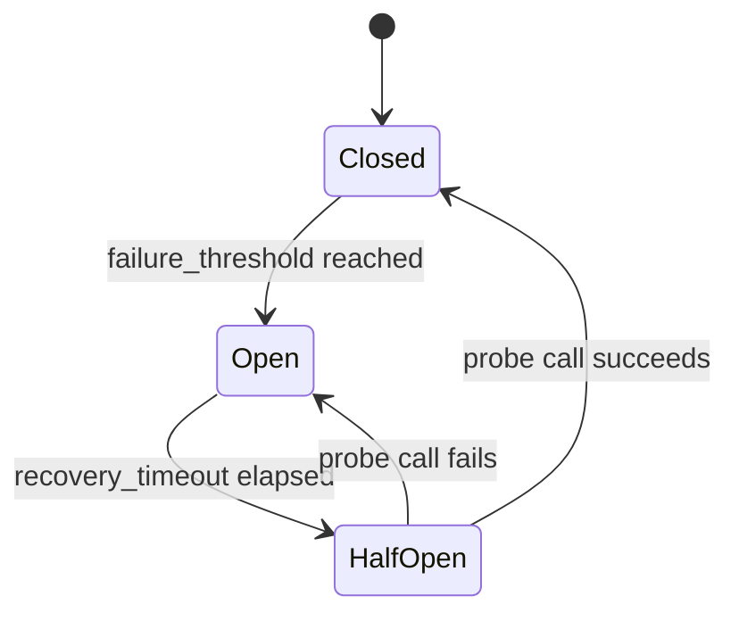

# Resilience Patterns

Keep your MCP server running reliably when things go wrong -- circuit breakers for flaky dependencies, health checks for monitoring, webhooks for alerting, background tasks for deferred work, and exception handlers for clean error responses.

## Circuit Breaker

### When you need it

Your MCP server wraps Stripe's payment API. When Stripe has an outage, every tool call to your server fails after a 30-second timeout. Without a circuit breaker, agents keep retrying, your server accumulates blocked connections, and everything slows to a crawl. With a circuit breaker, the server immediately tells agents "try again later" instead of waiting for Stripe to time out.

### `CircuitBreakerMiddleware`

```python
from promptise.mcp.server import MCPServer, CircuitBreakerMiddleware

server = MCPServer(name="payment-api")
server.add_middleware(CircuitBreakerMiddleware(
    failure_threshold=5,           # Open after 5 consecutive failures
    recovery_timeout=60.0,         # Wait 60s before testing recovery
    excluded_tools={"health"},     # Never circuit-break health checks
))

@server.tool()
async def charge_card(
    customer_id: str,
    amount_cents: int,
    currency: str = "usd",
) -> dict:
    """Charge a customer's card via Stripe.

    If Stripe is down, the circuit breaker trips after 5 failures
    and immediately rejects calls for 60 seconds instead of
    waiting for timeouts.
    """
    import stripe
    charge = await stripe.Charge.create(
        customer=customer_id,
        amount=amount_cents,
        currency=currency,
    )
    return {"charge_id": charge.id, "status": charge.status}
```

### How it works



| State | Behavior |
|-------|----------|
| **Closed** | Normal operation. Failures increment a counter. |
| **Open** | All calls rejected immediately with `CircuitOpenError`. |
| **Half-Open** | One probe call allowed through. Success → Closed. Failure → Open. |

### Handling `CircuitOpenError`

Agents receive a structured error when the circuit is open:

```python
from promptise.mcp.server import CircuitOpenError

@server.exception_handler(CircuitOpenError)
async def handle_circuit_open(ctx, exc):
    from promptise.mcp.server import ToolError
    return ToolError(
        message=f"Service temporarily unavailable. Retry in {exc.retry_after:.0f}s.",
        code="SERVICE_UNAVAILABLE",
        retryable=True,
    )
```

### Configuration

| Parameter | Default | Description |
|-----------|---------|-------------|
| `failure_threshold` | `5` | Consecutive failures before opening |
| `recovery_timeout` | `60.0` | Seconds before probing recovery |
| `excluded_tools` | `set()` | Tools exempt from circuit breaking |

### Programmatic control

```python
cb = CircuitBreakerMiddleware(failure_threshold=5)
server.add_middleware(cb)

# Check state
cb.get_state("charge_card")  # CircuitState.CLOSED / OPEN / HALF_OPEN

# Manual reset (e.g., after fixing the dependency)
cb.reset("charge_card")  # Reset one tool
cb.reset()               # Reset all
```

---

## Health Checks

### When you need it

Your MCP server runs in Kubernetes. Kubernetes needs to know if the server is alive (liveness probe) and ready to accept traffic (readiness probe). If your database is down, the server should report "not ready" so Kubernetes routes traffic elsewhere.

### `HealthCheck`

```python
from promptise.mcp.server import MCPServer, HealthCheck

server = MCPServer(name="api")
health = HealthCheck()

# Required check — server is "not ready" if this fails
async def check_database() -> bool:
    try:
        await db.execute("SELECT 1")
        return True
    except Exception:
        return False

health.add_check("database", check_database, required_for_ready=True)

# Optional check — logged but doesn't affect readiness
async def check_cache() -> bool:
    return cache.is_connected()

health.add_check("cache", check_cache, required_for_ready=False)

# Register as MCP resources
health.register_resources(server)
```

This exposes two resources:

| Resource URI | Purpose |
|-------------|---------|
| `health://live` | Liveness: is the server process running? |
| `health://ready` | Readiness: are all required dependencies available? |

Agents or monitoring systems can read these resources to check server health.

---

## Webhook Notifications

### When you need it

Your ops team uses Slack for alerts. When a tool call fails, you want a Slack message immediately -- not waiting for someone to check logs.

### `WebhookMiddleware`

```python
from promptise.mcp.server import MCPServer, WebhookMiddleware

server = MCPServer(name="api")
server.add_middleware(WebhookMiddleware(
    url="https://hooks.slack.com/services/T.../B.../xxx",
    events={"tool.error"},              # Only fire on errors
    headers={"Authorization": "Bearer slack-token"},
    timeout=5.0,                        # Don't block tool calls
))
```

### Events

| Event | When fired |
|-------|-----------|
| `tool.call` | Before every tool execution |
| `tool.success` | After successful execution |
| `tool.error` | After an exception |

### Webhook payload

```json
{
  "event": "tool.error",
  "tool": "charge_card",
  "client_id": "checkout-agent",
  "request_id": "f6e5d4",
  "timestamp": 1709812345.6,
  "error": "stripe.error.CardDeclinedError: Card declined"
}
```

Webhooks are fire-and-forget -- they never block or fail the tool call. If the webhook endpoint is unreachable, the failure is logged and the tool call proceeds normally.

---

## Background Tasks

### When you need it

After creating a user, you want to send a welcome email and log an analytics event. These are important but shouldn't delay the tool response.

### `BackgroundTasks`

```python
from promptise.mcp.server import MCPServer, BackgroundTasks, Depends

server = MCPServer(name="hr-api")

async def send_welcome_email(employee_id: str, email: str):
    """Send welcome email (runs after response is sent)."""
    await email_service.send(
        to=email,
        subject="Welcome to the team!",
        template="welcome",
        data={"employee_id": employee_id},
    )

async def log_audit_event(action: str, actor: str, details: dict):
    """Log to external audit system."""
    await audit_api.log(action=action, actor=actor, details=details)

@server.tool(auth=True)
async def create_employee(
    name: str,
    email: str,
    department: str,
    bg: BackgroundTasks = Depends(BackgroundTasks),
) -> dict:
    """Create an employee.

    Welcome email and audit log run in the background after the
    response is returned. If they fail, it's logged but doesn't
    affect the response.
    """
    from promptise.mcp.server import get_context
    ctx = get_context()

    emp_id = await db.create_employee(name=name, email=email, dept=department)

    bg.add(send_welcome_email, emp_id, email)
    bg.add(log_audit_event, "CREATE_EMPLOYEE", ctx.client_id, {"id": emp_id})

    return {"id": emp_id, "name": name, "status": "created"}
```

Background tasks run sequentially after the tool response is sent. If a task raises an exception, it's logged but remaining tasks still run.

---

## Exception Handlers

### When you need it

Your tools raise domain-specific exceptions (`EmployeeNotFoundError`, `InsufficientFundsError`). Without exception handlers, agents see generic "Internal error" messages. With handlers, they get structured, actionable error responses.

### Custom exception mapping

```python
from promptise.mcp.server import MCPServer, ToolError

class EmployeeNotFoundError(Exception):
    def __init__(self, employee_id: str):
        self.employee_id = employee_id
        super().__init__(f"Employee {employee_id} not found")

class InsufficientPermissionsError(Exception):
    pass

server = MCPServer(name="hr-api")

@server.exception_handler(EmployeeNotFoundError)
async def handle_not_found(ctx, exc):
    return ToolError(
        message=f"Employee '{exc.employee_id}' does not exist.",
        code="EMPLOYEE_NOT_FOUND",
        retryable=False,
    )

@server.exception_handler(InsufficientPermissionsError)
async def handle_permissions(ctx, exc):
    return ToolError(
        message="You don't have permission for this action.",
        code="FORBIDDEN",
        retryable=False,
    )

@server.tool()
async def get_employee(employee_id: str) -> dict:
    """Get an employee by ID."""
    record = await db.get_employee(employee_id)
    if record is None:
        raise EmployeeNotFoundError(employee_id)
    return record
```

The handler receives the `RequestContext` and the exception. It returns a `ToolError` that's sent to the client as a structured error response.

**MRO-based matching**: If you register a handler for `ValueError` and throw a `SpecificValueError(ValueError)`, the `ValueError` handler catches it. The most specific handler in the MRO wins.

---

## Progress Reporting

### When you need it

Your tool processes a large dataset and takes 30+ seconds. Without progress, the agent (or human watching) has no idea if it's stuck or working.

### `ProgressReporter`

```python
from promptise.mcp.server import MCPServer, ProgressReporter, Depends

server = MCPServer(name="data-pipeline")

@server.tool()
async def process_dataset(
    dataset_url: str,
    progress: ProgressReporter = Depends(ProgressReporter),
) -> dict:
    """Process a large dataset with progress reporting."""
    await progress.report(0, total=100, message="Downloading dataset...")
    data = await download(dataset_url)

    rows = parse_csv(data)
    processed = 0
    for i, row in enumerate(rows):
        await transform_row(row)
        processed += 1
        if i % 100 == 0:
            pct = int((i / len(rows)) * 100)
            await progress.report(pct, total=100, message=f"Processed {i}/{len(rows)} rows")

    await progress.report(100, total=100, message="Complete")
    return {"processed": processed, "total": len(rows)}
```

Progress notifications are sent via MCP's `notifications/progress`. The client receives them in real-time and can display a progress bar or status message.

If the client doesn't support progress (no `progressToken` in the request), the `report()` calls are silently ignored.

---

## Cancellation

### When you need it

An agent starts a 5-minute data processing job, then the user decides they don't need it anymore. Without cancellation support, the job runs to completion, wasting resources.

### `CancellationToken`

```python
from promptise.mcp.server import MCPServer, CancellationToken, Depends

server = MCPServer(name="data-pipeline")

@server.tool()
async def long_running_task(
    dataset: str,
    cancel: CancellationToken = Depends(CancellationToken),
) -> dict:
    """Process a dataset. Can be cancelled by the client."""
    results = []
    for chunk in load_chunks(dataset):
        cancel.check()  # Raises CancelledError if cancelled
        results.extend(await process_chunk(chunk))
    return {"processed": len(results)}
```

You can also wait for cancellation with a timeout:

```python
@server.tool()
async def poll_for_updates(
    topic: str,
    cancel: CancellationToken = Depends(CancellationToken),
) -> dict:
    """Poll until cancelled or timeout."""
    updates = []
    while True:
        cancelled = await cancel.wait(timeout=5.0)
        if cancelled:
            break
        new = await fetch_updates(topic)
        updates.extend(new)
    return {"updates": updates}
```

---

## Combining Resilience Features

A real production server uses multiple resilience patterns together:

```python
from promptise.mcp.server import (
    MCPServer, AuthMiddleware, JWTAuth,
    CircuitBreakerMiddleware, WebhookMiddleware,
    AuditMiddleware, HealthCheck,
)

server = MCPServer(name="payment-api")
health = HealthCheck()

# Middleware stack
server.add_middleware(AuditMiddleware(log_path="audit.jsonl", signed=True))
server.add_middleware(WebhookMiddleware(
    url="https://hooks.slack.com/services/...",
    events={"tool.error"},
))
server.add_middleware(CircuitBreakerMiddleware(
    failure_threshold=5,
    recovery_timeout=60.0,
    excluded_tools={"health"},
))
server.add_middleware(AuthMiddleware(JWTAuth(secret="...")))

# Health checks
async def check_stripe():
    return await stripe_client.is_available()

health.add_check("stripe", check_stripe, required_for_ready=True)
health.register_resources(server)
```

---

## API Summary

| Symbol | Type | Description |
|--------|------|-------------|
| `CircuitBreakerMiddleware(...)` | Class | Circuit breaker for downstream protection |
| `CircuitOpenError` | Exception | Raised when circuit is open |
| `CircuitState` | Enum | `CLOSED`, `OPEN`, `HALF_OPEN` |
| `HealthCheck()` | Class | Health and readiness probe manager |
| `WebhookMiddleware(url, events, ...)` | Class | Fire webhooks on tool events |
| `BackgroundTasks()` | Class | Fire-and-forget task scheduler |
| `ExceptionHandlerRegistry` | Class | Map exceptions to MCP error responses |
| `ProgressReporter` | Class | Report progress during long tools (via DI) |
| `CancellationToken` | Class | Check/wait for client cancellation (via DI) |

## What's Next

- [Caching & Performance](caching-performance.md) -- Cache, rate limit, concurrency control
- [Observability & Monitoring](observability.md) -- Metrics, tracing, Prometheus, logging
- [Advanced Patterns](advanced-patterns.md) -- Composition, versioning, transforms, OpenAPI
