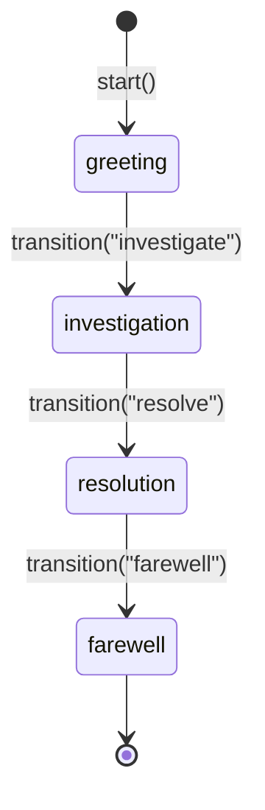

# Layer 2: ConversationFlow

Build conversation agents where the system prompt evolves across phases -- different blocks activate as the conversation progresses.

## Quick Example

```python
from promptise.prompts.flows import ConversationFlow, TurnContext, phase
from promptise.prompts.blocks import Identity, Rules, Section, OutputFormat

class SupportFlow(ConversationFlow):
    base_blocks = [
        Identity("Customer support specialist", traits=["empathetic", "patient"]),
        Rules(["Never blame the customer", "Keep responses to 2-3 sentences"]),
    ]

    @phase("greeting", initial=True)
    async def greet(self, ctx: TurnContext) -> None:
        ctx.activate(Section("greet", "Ask how you can help today."))

    @phase("investigate")
    async def investigate(self, ctx: TurnContext) -> None:
        ctx.deactivate("greet")
        ctx.activate(Section("investigate", "Ask clarifying questions."))

    @phase("resolve")
    async def resolve(self, ctx: TurnContext) -> None:
        ctx.deactivate("investigate")
        ctx.activate(OutputFormat(format="markdown"))
        ctx.activate(Section("resolve", "Propose a concrete solution."))

flow = SupportFlow()
prompt = await flow.start()                        # Enter greeting phase
prompt = await flow.next_turn("My app crashed")    # Process user message
await flow.transition("investigate")               # Move to investigate
prompt = await flow.next_turn("It crashes on login")
```

## Concepts

A `ConversationFlow` is a state machine where:

- **Phases** define distinct conversation stages (greeting, investigation, resolution)
- **Base blocks** are always included in the prompt regardless of phase
- **Phase handlers** activate and deactivate blocks as the conversation evolves
- The system prompt is **not static** -- it is reassembled every turn with the currently active blocks

Each call to `next_turn()` or `transition()` runs the current phase handler, which can modify the active block composition, then returns a freshly assembled `AssembledPrompt`.



## Defining a Flow

### Subclass `ConversationFlow`

Set `base_blocks` as a class variable for blocks that are always active:

```python
from promptise.prompts.flows import ConversationFlow
from promptise.prompts.blocks import Identity, Rules

class MyFlow(ConversationFlow):
    base_blocks = [
        Identity("Helpful assistant"),
        Rules(["Be concise", "Ask before making assumptions"]),
    ]
```

### Define Phases with `@phase`

Use the `@phase` decorator on async methods. Mark exactly one phase as `initial=True`:

```python
from promptise.prompts.flows import phase, TurnContext
from promptise.prompts.blocks import Section, OutputFormat

class MyFlow(ConversationFlow):
    base_blocks = [Identity("Assistant")]

    @phase("greeting", initial=True)
    async def greet(self, ctx: TurnContext) -> None:
        ctx.activate(Section("greet", "Welcome the user warmly."))

    @phase("working", blocks=[OutputFormat(format="json")])
    async def work(self, ctx: TurnContext) -> None:
        ctx.deactivate("greet")
        ctx.activate(Section("work", "Focus on completing the task."))
```

The `@phase` decorator accepts:

| Parameter | Type | Description |
|-----------|------|-------------|
| `name` | `str` | Phase name (used for transitions) |
| `initial` | `bool` | Whether this is the starting phase (exactly one required) |
| `blocks` | `list[Block]` | Blocks auto-activated on phase entry, auto-deactivated on exit |
| `on_enter` | `Callable` | Callback invoked when entering this phase |
| `on_exit` | `Callable` | Callback invoked when leaving this phase |

## TurnContext

Every phase handler receives a `TurnContext` that provides methods to manipulate the prompt and control flow.

### Properties

| Property | Type | Description |
|----------|------|-------------|
| `turn` | `int` | Current turn number (0-based) |
| `phase` | `str` | Current phase name |
| `state` | `dict[str, Any]` | Arbitrary flow state dict -- mutate freely |
| `history` | `list[dict]` | Conversation message history (read-only copy) |

### Block Manipulation

```python
@phase("investigate")
async def investigate(self, ctx: TurnContext) -> None:
    # Remove a block from the active composition
    ctx.deactivate("greeting_instructions")

    # Add a new block
    ctx.activate(Section("investigate", "Ask clarifying questions."))

    # Fill a ContextSlot by name
    ctx.fill_slot("user_info", "Premium customer since 2023")
```

| Method | Description |
|--------|-------------|
| `activate(block)` | Add a block to the active prompt composition |
| `deactivate(name)` | Remove a block by name |
| `fill_slot(name, value)` | Fill a `ContextSlot` block by name |
| `transition(phase_name)` | Request a phase transition (happens after handler completes) |
| `get_prompt()` | Assemble the current prompt without advancing the turn |

### In-Handler Transitions

Call `ctx.transition()` inside a phase handler to request a transition after the current handler completes:

```python
@phase("greeting", initial=True)
async def greet(self, ctx: TurnContext) -> None:
    if ctx.state.get("returning_customer"):
        ctx.transition("working")  # Skip to working phase
    else:
        ctx.activate(Section("greet", "Welcome! How can I help?"))
```

## Flow Lifecycle

### Starting the Flow

`start()` enters the initial phase, runs its handler, and returns the first assembled prompt:

```python
flow = SupportFlow()
prompt = await flow.start()
print(prompt.text)              # Full prompt with base + greeting blocks
print(prompt.included)          # ["identity", "rules", "greeting_instructions"]
```

### Processing Turns

`next_turn()` records the user message in history, runs the current phase handler, and returns the updated prompt:

```python
prompt = await flow.next_turn("My app keeps crashing")
print(prompt.text)  # Prompt reflects current phase blocks
```

Optional parameters:

```python
prompt = await flow.next_turn(
    "Details about the crash",
    assistant_message="I understand, let me help.",  # Record assistant reply
    transition_to="resolution",   # Force a phase transition before processing
)
```

### Explicit Transitions

`transition()` moves to a new phase, runs the new phase handler, and returns the updated prompt:

```python
prompt = await flow.transition("resolution")
```

### Reading the Current Prompt

`get_prompt()` assembles the current state without advancing the turn counter:

```python
prompt = flow.get_prompt()
```

### Resetting

`reset()` clears all state, history, active blocks, and the turn counter:

```python
flow.reset()
# Flow is now back to its initial state, ready for start()
```

## Integration with `build_agent`

Pass a `ConversationFlow` to `build_agent()` and the prompt auto-evolves on each `ainvoke()`:

```python
from promptise import build_agent

flow = SupportFlow()
agent = build_agent(flow=flow)
```

## Full Example: Customer Support Agent

```python
import asyncio
from promptise.prompts import prompt
from promptise.prompts.blocks import Identity, Rules, Section, OutputFormat
from promptise.prompts.flows import ConversationFlow, TurnContext, phase

class SupportFlow(ConversationFlow):
    base_blocks = [
        Identity(
            "Customer support specialist for TechCorp",
            traits=["empathetic", "patient", "solution-oriented"],
        ),
        Rules([
            "Never blame the customer",
            "Acknowledge frustration before problem-solving",
            "Keep responses to 2-3 sentences",
        ]),
    ]

    @phase("greeting", initial=True)
    async def greet(self, ctx: TurnContext) -> None:
        ctx.activate(Section(
            "greeting_instructions",
            "Warmly greet the customer. Ask how you can help today.",
        ))

    @phase("investigation")
    async def investigate(self, ctx: TurnContext) -> None:
        ctx.deactivate("greeting_instructions")
        ctx.activate(Section(
            "investigation_instructions",
            "Ask clarifying questions: what happened, when, what they tried.",
        ))

    @phase("resolution")
    async def resolve(self, ctx: TurnContext) -> None:
        ctx.deactivate("investigation_instructions")
        ctx.activate(Section("resolution_instructions", "Propose a concrete fix."))
        ctx.activate(OutputFormat(format="markdown"))

    @phase("farewell")
    async def farewell(self, ctx: TurnContext) -> None:
        ctx.deactivate("resolution_instructions")
        ctx.deactivate("output_format")
        ctx.activate(Section("farewell_instructions", "Thank the customer."))

@prompt(model="openai:gpt-5-mini")
async def respond(system_prompt: str, conversation: str) -> str:
    """{system_prompt}

Conversation so far:
{conversation}

Respond as the support agent:"""

async def main():
    flow = SupportFlow()
    assembled = await flow.start()

    # Greeting
    response = await respond(
        system_prompt=assembled.text,
        conversation="(Customer just connected)",
    )
    print(f"Agent: {response}")

    # Customer describes issue -> transition to investigation
    assembled = await flow.next_turn(
        "My app crashes on file upload",
        transition_to="investigation",
    )
    response = await respond(
        system_prompt=assembled.text,
        conversation="Customer: My app crashes on file upload",
    )
    print(f"Agent: {response}")

asyncio.run(main())
```

## API Reference

### ConversationFlow

| Method | Returns | Description |
|--------|---------|-------------|
| `start()` | `AssembledPrompt` | Enter initial phase and return first prompt |
| `next_turn(user_message, ...)` | `AssembledPrompt` | Process a turn and return updated prompt |
| `transition(phase_name)` | `AssembledPrompt` | Transition to a new phase |
| `get_prompt()` | `AssembledPrompt` | Get current prompt without advancing turn |
| `reset()` | `None` | Reset to initial state |

### TurnContext

| Method | Description |
|--------|-------------|
| `activate(block)` | Add a block to the active composition |
| `deactivate(name)` | Remove a block by name |
| `fill_slot(name, value)` | Fill a ContextSlot |
| `transition(phase_name)` | Request a deferred phase transition |
| `get_prompt()` | Assemble and return current prompt |

!!! warning "One initial phase required"
    Exactly one phase must be marked `initial=True`. Defining zero or multiple initial phases raises a `ValueError`.

## Tips

- Use `ctx.state` to track conversation metadata (e.g., `questions_asked`, `issue_category`) across phases.
- Phase handlers run on every turn within that phase -- use them to dynamically adjust blocks based on conversation progress.
- Blocks from `@phase(blocks=[...])` are automatically activated on phase entry and deactivated on exit. Blocks added via `ctx.activate()` persist until explicitly deactivated.
- `flow._history` stores all user and assistant messages. Use `ctx.history` for a read-only copy inside handlers.

## What's Next?

- [Strategies](strategies.md) -- Prompt strategies and composition patterns
- [Layer 1: PromptBlocks](blocks.md) -- Composable prompt components reference
