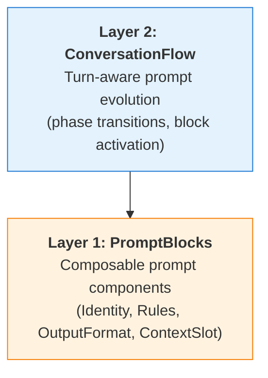

# Prompt Engineering Overview

Promptise provides a composable prompt engineering framework -- compose prompts from reusable blocks, evolve them across conversation turns, and enhance them with strategies, guards, context injection, and inspection tools.

## Quick Example

```python
from promptise.prompts import prompt
from promptise.prompts.blocks import blocks, Identity, Rules, OutputFormat

@prompt(model="openai:gpt-5-mini")
@blocks(
    Identity("Senior data analyst", traits=["precise", "data-driven"]),
    Rules(["Cite specific numbers", "Include confidence levels"]),
    OutputFormat(format="markdown"),
)
async def analyze(text: str) -> str:
    """Analyze the following data and provide insights: {text}"""

result = await analyze("Q1 revenue: $2.3M, Q2: $2.8M, Q3: $3.1M")
```

The `@prompt` decorator turns any async function into an LLM-backed prompt. The docstring becomes the template, and `{text}` is filled from the function argument. The `@blocks` decorator attaches composable prompt components that are assembled into the system prompt at execution time.

## The 2-Layer Architecture

Each layer is independent. Use one or both depending on the complexity of your use case.



| Layer | Module | Purpose |
|-------|--------|---------|
| **Layer 1** | `promptise.prompts.blocks` | Composable, priority-ranked prompt components |
| **Layer 2** | `promptise.prompts.flows` | Conversation state machine where the system prompt evolves across phases |

## The `@prompt` Decorator

The `@prompt` decorator is the core entry point. It wraps an async function into a `Prompt` object that can call an LLM directly or integrate with `build_agent()`.

```python
from promptise.prompts import prompt

@prompt(model="openai:gpt-5-mini")
async def summarize(text: str) -> str:
    """Summarize the following: {text}"""

# Standalone call
result = await summarize("Long article text here...")

# Agent integration -- prompt auto-evolves on each invocation
from promptise import build_agent
agent = build_agent(instructions=summarize)
```

**Dual-mode operation:**

- **Standalone** -- `await my_prompt("input")` calls the LLM directly with the full pipeline: template, context, perspective, strategy, constraints, guards, LLM call, parse, output guards.
- **Agent-integrated** -- `build_agent(instructions=my_prompt)` uses `render_async()` to build dynamic system prompts on every agent invocation.

### Runtime Composition

`Prompt` objects support fluent composition methods that return new configured copies:

```python
from promptise.prompts.strategies import chain_of_thought, analyst

configured = (
    summarize
    .with_strategy(chain_of_thought)
    .with_perspective(analyst)
    .with_constraints("Under 500 words", "Include confidence scores")
)
result = await configured("quarterly earnings report...")
```

### Prompt Composition Methods

The `Prompt` object returned by `@prompt` supports a full set of fluent composition methods. Every method returns a **new copy** of the prompt, leaving the original unchanged.

**Model and component attachment:**

```python
from promptise.prompts.blocks import Identity, Rules
from promptise.prompts.guards import length, content_filter
from promptise.prompts.inspector import PromptInspector
from promptise.prompts.context import UserContext

# Override the model for a single call
fast = summarize.with_model("openai:gpt-5-mini")

# Attach blocks at runtime
with_blocks = summarize.with_blocks(
    Identity("Senior analyst"),
    Rules(["Be concise"]),
)

# Attach guards at runtime
guarded = summarize.with_guards(
    content_filter(blocked=["secret"]),
    length(max_length=2000),
)

# Attach an inspector for tracing
inspector = PromptInspector()
traced = summarize.with_inspector(inspector)

# Inject world context
contextualized = summarize.with_world(user=UserContext(name="Alice", expertise_level="expert"))
```

**Lifecycle hooks:**

```python
async def log_before(prompt_name, input_text):
    print(f"[{prompt_name}] Starting with: {input_text[:80]}...")

async def log_after(prompt_name, output):
    print(f"[{prompt_name}] Completed, output length: {len(output)}")

async def handle_error(prompt_name, error):
    print(f"[{prompt_name}] Failed: {error}")

hooked = (
    summarize
    .on_before(log_before)
    .on_after(log_after)
    .on_error(handle_error)
)
result = await hooked("quarterly earnings report...")
```

**Introspection (no LLM call):**

```python
from promptise.prompts.context import PromptContext

ctx = PromptContext(variables={"text": "sample input"})

# Get the LangChain messages that would be sent, without calling the LLM
messages = summarize.to_messages(ctx)

# Access the raw template string
print(summarize.template)  # "Summarize the following: {text}"

# Access the configured return type
print(summarize.return_type)  # <class 'str'>
```

| Method | Returns | Description |
|--------|---------|-------------|
| `with_model(model)` | `Prompt` | Override the LLM model |
| `with_blocks(*blocks)` | `Prompt` | Attach composable prompt blocks |
| `with_guards(*guards)` | `Prompt` | Attach input/output guards |
| `with_inspector(inspector)` | `Prompt` | Attach a `PromptInspector` for tracing |
| `with_world(**contexts)` | `Prompt` | Inject named `BaseContext` objects |
| `with_strategy(strategy)` | `Prompt` | Set reasoning strategy |
| `with_perspective(perspective)` | `Prompt` | Set cognitive perspective |
| `with_constraints(*texts)` | `Prompt` | Add constraint strings |
| `on_before(fn)` | `Prompt` | Register a pre-execution hook |
| `on_after(fn)` | `Prompt` | Register a post-execution hook |
| `on_error(fn)` | `Prompt` | Register an error-handling hook |
| `to_messages(ctx)` | `list` | Get LangChain messages without calling the LLM |
| `template` | `str` | Access the raw template string (property) |
| `return_type` | `type` | Access the configured return type (property) |

## Strategies

Strategies control **how** the agent reasons. They wrap the prompt text with reasoning instructions before the LLM call, then parse the structured output afterward.

| Strategy | Reasoning Approach |
|----------|-------------------|
| `chain_of_thought` | Step-by-step breakdown with `---ANSWER---` marker |
| `structured_reasoning` | Customizable phases (Understand, Analyze, Evaluate, Conclude) |
| `self_critique` | Generate, critique for flaws, then produce improved answer |
| `plan_and_execute` | Create a numbered plan, execute each step, synthesize |
| `decompose` | Break into subproblems, solve independently, combine |

Strategies compose with the `+` operator:

```python
from promptise.prompts.strategies import chain_of_thought, self_critique

combined = chain_of_thought + self_critique
```

## Perspectives

Perspectives control **from where** the agent reasons. They are orthogonal to strategies -- any perspective can pair with any strategy.

| Perspective | Framing |
|-------------|---------|
| `analyst` | Evidence-based, data patterns, measurable outcomes |
| `critic` | Challenge assumptions, identify weaknesses, stress-test |
| `advisor` | Balanced recommendations, trade-off analysis, actionable steps |
| `creative` | Unconventional solutions, novel combinations, innovation |

```python
from promptise.prompts.strategies import chain_of_thought, analyst

@prompt(model="openai:gpt-5-mini")
async def evaluate(proposal: str) -> str:
    """Evaluate this proposal: {proposal}"""

result = await evaluate.with_strategy(chain_of_thought).with_perspective(analyst)(
    "Expand into the European market next quarter"
)
```

## API Summary

| Component | Import | Purpose |
|-----------|--------|---------|
| `@prompt` | `promptise.prompts` | Core decorator for LLM-backed functions |
| `@blocks` | `promptise.prompts.blocks` | Attach composable prompt blocks |
| `@guard` | `promptise.prompts.guards` | Input/output validation |
| `@context` | `promptise.prompts.context` | Dynamic context injection |
| `ConversationFlow` | `promptise.prompts.flows` | Phase-based conversation state machine |
| `PromptBuilder` | `promptise.prompts.builder` | Fluent runtime prompt construction |
| `PromptSuite` | `promptise.prompts.suite` | Group related prompts with shared config |
| `PromptRegistry` | `promptise.prompts.registry` | Versioned prompt storage |
| `PromptInspector` | `promptise.prompts.inspector` | Assembly and execution tracing |

!!! tip "Choosing the right layer"
    - **Simple single-turn prompts** -- Use `@prompt` with `@blocks` (Layer 1)
    - **Multi-turn conversations** -- Add `ConversationFlow` (Layer 2)

## What's Next?

- [Layer 1: PromptBlocks](blocks.md) -- Build prompts from composable components
- [Layer 2: ConversationFlow](flows.md) -- Evolve prompts across conversation turns
- [Strategies](strategies.md) -- Prompt strategies and composition patterns
- [Guards & Validation](guards.md) -- Input validation and safety guards
