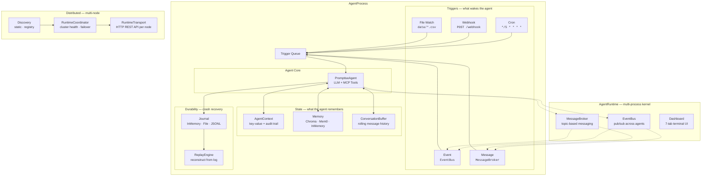

# Agent Runtime

LLMs are stateless by nature -- they don't remember, they don't persist, and they can't react to the world on their own. The Agent Runtime is the **operating system for your AI agents**. It gives a stateless LLM everything a real process needs: lifecycle management, scheduling, persistent state, inter-agent communication, crash recovery, and multi-node scaling.

---

## Why You Need It

A standard `build_agent()` call creates a request-response agent. You send a message, get a reply, and the agent disappears. That works for chatbots and one-off tasks, but real-world agent systems need more:

- **Persistence** -- Agents that remember what they've seen, track metrics over time, and maintain context across invocations
- **Reactivity** -- Agents that wake up on schedules, respond to webhooks, watch files for changes, or listen to events from other agents
- **Resilience** -- Agents that recover from crashes, replay missed events, and restart automatically after failures
- **Scale** -- Multiple agents running in parallel, coordinating across machines, sharing communication channels

The Agent Runtime adds all of this on top of the same agent you already know how to build.

---

## Core Concepts

### Agent Processes

An **AgentProcess** wraps a `PromptiseAgent` in a managed lifecycle container. It handles building the agent, connecting MCP servers, starting triggers, and invoking the agent when events arrive. Each process follows a deterministic state machine: created, starting, running, suspended, awaiting, stopping, stopped, or failed. All transitions are validated and recorded.

### Triggers

Triggers are how agents wake up. Instead of calling `agent.ainvoke()` manually, you configure triggers that fire automatically:

- **Cron** -- Run every 5 minutes, hourly, daily at midnight, or any cron expression
- **Webhook** -- Listen for incoming HTTP requests from CI/CD systems, monitoring tools, or external APIs
- **File Watch** -- React to file system changes (new files, modifications, deletions)
- **Event** -- Subscribe to events broadcast by other agents through a shared EventBus
- **Message** -- Receive targeted messages on specific topics through a MessageBroker

You can compose multiple triggers on a single agent. A monitoring agent might use a cron trigger for scheduled health checks and an event trigger for critical alerts from other agents.

### Context and State

Every process has an **AgentContext** that persists across invocations. It's a key-value store with an audit trail -- every write records who changed what and when. The context is injected into every agent invocation as a system message, so the agent always has access to its accumulated state.

Context also manages long-term memory (ChromaDB, Mem0, or in-memory), environment variables, and file mounts. Short-term memory is handled by a rolling **ConversationBuffer** that maintains recent conversation history within each process.

### Journals and Recovery

The **journal system** records every state transition, trigger event, and invocation result in a durable log. If a process crashes, the **ReplayEngine** reconstructs its last known state from the journal -- including context, lifecycle position, and conversation history. Combined with automatic restart policies, this gives you crash recovery without manual intervention.

### Governance

Autonomous agents need guardrails. The runtime provides four governance subsystems that are fully opt-in:

- **[Autonomy Budget](governance/budget.md)** -- per-run and daily limits on tool calls, LLM turns, cost (abstract units), and irreversible actions. Enforcement can pause, stop, or escalate. Prevents runaway loops and unexpected costs.
- **[Behavioral Health](governance/health.md)** -- detects bad patterns without calling an LLM: stuck agents (same tool 3+ times), repeating loops (A→B→A→B), empty responses, and elevated error rates. Pauses or escalates on anomaly.
- **[Mission Model](governance/mission.md)** -- mission-oriented execution with an objective and success criteria. Every N invocations, an LLM-as-judge evaluates progress. Catches trajectory drift that individual events don't reveal.
- **[Secret Scoping](governance/secrets.md)** -- per-process secret vault with Fernet encryption in memory, TTL-based expiry, rotation without restart, and access logging. Secrets are never written to the journal or status output.

All four are disabled by default with zero overhead. Enable them one at a time as you move an agent from prototype to production. They work standalone or together.

### Runtime Manager

An **AgentRuntime** manages multiple `AgentProcess` instances with centralized lifecycle control. You can start, stop, restart, and monitor all your agents from one place. The runtime provides a shared **EventBus** and **MessageBroker** for inter-agent communication, and can load agent definitions from `.agent` YAML manifest files or entire directories.

### Distributed Coordination

For production deployments across multiple machines, **RuntimeTransport** exposes each node's runtime over HTTP, and **RuntimeCoordinator** manages cluster membership with health checks and node discovery. Each node exposes a REST API for remote process management.

---

## The Full Picture

Every component works together as a single integrated system. Here's what runs inside one `AgentProcess`:



That's not a roadmap -- it's what ships today. Every box in that diagram is a working component you can configure in a few lines of Python or a `.agent` YAML file.

### What each layer gives you

| Layer | Components | What it unlocks |
|-------|-----------|-----------------|
| **Triggers** | Cron, Webhook, File Watch, Event, Message | Agents that wake up on their own -- no manual `ainvoke()` calls |
| **State** | AgentContext, MemoryProvider, ConversationBuffer | Agents that remember across invocations -- accumulated metrics, customer history, conversation continuity |
| **Durability** | Journal (InMemory/File), ReplayEngine, restart policies | Agents that survive crashes -- replay missed events, reconstruct state, restart automatically |
| **Runtime** | AgentRuntime, EventBus, MessageBroker, Dashboard | Multiple agents running together -- sharing events, routing messages, monitored from one terminal |
| **Distributed** | RuntimeCoordinator, RuntimeTransport, Discovery | Agents across machines -- HTTP API per node, health checks, cluster membership, process redistribution |
| **Self-modification** | Open mode, 14 meta-tools | Agents that evolve -- modify their own instructions, create tools, connect servers, spawn new processes |

---

## What Can You Build?

The runtime isn't limited to one pattern. Combine triggers, state, communication, and recovery to build systems that would otherwise require custom infrastructure:

### Autonomous operations

| System | Triggers | State | Communication | How it works |
|--------|----------|-------|---------------|--------------|
| **Pipeline monitor** | Cron (every 5 min) | Context stores metrics history | EventBus alerts | Agent checks data pipeline health on schedule, compares against stored baselines, fires `pipeline.degraded` events when anomalies appear |
| **Infrastructure watchdog** | Cron + Webhook | Context tracks uptime, incident count | MessageBroker escalation | Scheduled health checks + receives PagerDuty webhooks, correlates incidents over time, escalates through message topics |
| **Cost optimizer** | Cron (daily) | Memory stores spending trends | EventBus recommendations | Analyzes cloud spend daily, remembers historical patterns via ChromaDB, publishes optimization suggestions that other agents can act on |

### Reactive systems

| System | Triggers | State | Communication | How it works |
|--------|----------|-------|---------------|--------------|
| **Data quality gate** | File Watch (`data/*.csv`) | Context stores validation history | MessageBroker publishes results | Reacts to new data files, validates schema and quality, publishes pass/fail results to a topic that downstream ETL agents consume |
| **CI/CD assistant** | Webhook (GitHub) | Context tracks deployment history | EventBus notifies team agents | Receives deployment webhooks, runs checks via MCP tools, posts results back to GitHub, fires events for rollback agents |
| **Document processor** | File Watch (`uploads/`) | Memory stores extracted entities | MessageBroker routes to specialists | Watches for uploaded documents, extracts structured data, stores in memory, routes to domain-specific agents for further processing |

### Multi-agent coordination

| System | Triggers | State | Communication | How it works |
|--------|----------|-------|---------------|--------------|
| **Incident response team** | Event (monitor fires alerts) | Each agent has own context | EventBus (broadcast) + MessageBroker (directed) | 3 agents: monitor detects → analyst diagnoses root cause → responder executes fixes. Each maintains its own state, coordinates through events |
| **Customer support escalation** | Message (support queue topic) | Memory tracks customer history | MessageBroker routes by tier | Tier-1 agent handles common questions, escalates to Tier-2 for complex issues, Tier-3 for engineering. Memory persists customer context across agents |
| **Research pipeline** | Event (new task assigned) | Context tracks research progress | EventBus (progress updates) | Searcher → Analyzer → Writer → Reviewer chain, each triggered by the previous agent's completion event, sharing findings through context |

### Self-evolving agents (Open mode)

With `execution_mode="open"`, agents get up to 14 meta-tools for self-modification (11 core + 3 governance, depending on enabled subsystems):

| Meta-tool | What it does |
|-----------|-------------|
| `modify_instructions` | Agent rewrites its own system prompt based on experience |
| `create_tool` | Agent creates new Python tools at runtime |
| `connect_mcp_server` | Agent discovers and connects to new MCP servers |
| `add_trigger` / `remove_trigger` | Agent adjusts its own wake-up schedule |
| `spawn_process` / `list_processes` | Agent creates and monitors child processes |
| `store_memory` / `search_memory` / `forget_memory` | Agent manages its own long-term memory |
| `list_capabilities` | Agent introspects its current tools and triggers |
| `get_secret` | Agent retrieves scoped secrets (when secrets enabled) |
| `check_budget` | Agent checks remaining autonomy budget (when budget enabled) |
| `check_mission` | Agent checks mission progress and evaluation (when mission enabled) |

This enables agents that adapt over time -- an ops agent that learns new runbooks, a support agent that creates shortcuts for common issues, or a research agent that refines its own methodology.

---

## Quick Example

A single agent with cron triggers, persistent state, and journal recovery:

```python
from promptise.runtime import AgentProcess, ProcessConfig, TriggerConfig

process = AgentProcess(
    name="data-watcher",
    config=ProcessConfig(
        model="openai:gpt-5-mini",
        instructions="You monitor data pipelines and alert on anomalies.",
        triggers=[
            TriggerConfig(type="cron", cron_expression="*/5 * * * *"),
        ],
    ),
)

await process.start()   # CREATED -> STARTING -> RUNNING
# Process runs autonomously, waking on every cron tick...
await process.stop()    # RUNNING -> STOPPING -> STOPPED
```

Three agents sharing events through a runtime:

```python
from promptise.runtime import AgentRuntime, RuntimeConfig

runtime = AgentRuntime(config=RuntimeConfig())

# Load agents from manifest files
await runtime.load_directory("agents/")

# Or register processes programmatically
await runtime.register(monitor_process)
await runtime.register(analyzer_process)
await runtime.register(responder_process)

# Start everything -- agents communicate via EventBus and MessageBroker
await runtime.start_all()
```

Declare agents in YAML manifests:

```yaml title="agents/monitor.agent"
version: "1.0"
name: pipeline-monitor
model: openai:gpt-5-mini
instructions: |
  You monitor data pipeline health. Check metrics every 5 minutes.
  Fire a 'pipeline.alert' event if any metric exceeds thresholds.
triggers:
  - type: cron
    cron_expression: "*/5 * * * *"
config:
  journal_level: full
  restart_on_failure: true
  max_restarts: 3
```

---

## How It All Fits Together

```
Layer 4: Distributed Coordination    Multi-node clusters, HTTP transport, discovery
         │
Layer 3: AgentRuntime                Multi-process manager, shared EventBus/Broker
         │
Layer 2: AgentProcess                Lifecycle, triggers, context, journal, recovery
         │
Layer 1: build_agent()               Stateless LLM agent with MCP tool access
```

Each layer is optional. Use Layer 1 alone for simple chatbots, add Layer 2 for autonomous agents, Layer 3 for multi-agent systems, and Layer 4 for production distributed deployments.

---

## What's Next

**Learn the concepts in depth:**

- [Agent Processes](processes.md) -- Lifecycle methods, triggers, and `ProcessConfig`
- [Runtime Manager](runtime-manager.md) -- Multi-process runtimes with `AgentRuntime`
- [Context & State](context.md) -- Persistent state, memory, and environment
- [Journal System](journal/index.md) -- Execution journals and crash recovery
- [Triggers](triggers/index.md) -- All five trigger types
- [Distributed](distributed/coordinator.md) -- Multi-node coordination
- [Agent Manifests](manifests.md) -- Declarative `.agent` YAML format

**Build something real:**

- [Building Agentic Runtime Systems](../guides/agentic-runtime.md) -- Step-by-step guide from single agent to distributed deployment
